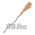

# ALL ITEMS of Dragon Quest I

## 📖 Table of contents

1. All Items
   - [Weapons](#weapons)
   - [Stuffs](#stuffs)
   - [Items](#items)
2.  [Return to Main Story](README.md)

# Weapons

| Weapon      | ID           | Attack | Buy  | Sell | Function                                             | Location                     |
|-------------|--------------|--------|------|------|------------------------------------------------------|------------------------------|
| 

 | bamboo pole    | 2      | 10   | 5    | Young sprout used by children playing heroes...      | Radatome, Melkido            |
| 

   | club| 4      | 60  | 30   | Large wooden club, suitable as a weapon for beginners| Radatome, Garai, Melkido |
| 

 | copper sword   | 10     | 180  | 90   | Copper sword for those initiated into fencing     | Radatome, Garai, Maira, Rimuldar, Melkido |
| 

 | iron axe | 15     | 560 | 280  | Very good value for money, this axe will do wonders  | Garai, Maira, Rimuldar, Melkido   |
| 

 | steel sword | 20     | 1500 | 750  | One of the swords you will wear for a long time | Rimuldar, Melkido           |
| 

  | flame sword | 28     | 9800 | 4900 | Very powerful sword, can be used to create flames    | Melkido       |
| 

   | sword of roto   | 40               | -    | -    | The legendary sword of hero Roto   | Dragon King's Castle, second floor          |

# Stuffs

| Armor             | ID              | Attack | Buy   | Sell  | Function                                                                                           | Location                                           |
|-------------------|-----------------|--------|-------|-------|----------------------------------------------------------------------------------------------------|----------------------------------------------------|
| 

     | plain clothes    | 2      | 20    | 10    | Normal clothes that won't offer much protection                                                     | Radatome                                           |
| 

   | leather clothes  | 4      | 70    | 35    | Clothes woven with reinforced fabric, likely your first protection                                   | Radatome, Garai, Melkido                            |
| 

        | chain mail       | 10     | 300   | 150   | Lightweight and efficient chainmail with a good price-performance ratio                              | Garai, Melkido                                     |
| 

        | iron armor       | 16     | 1000  | 500   | Heavy iron armored suit                                                                            | Maira, Rimuldar                                    |
| 

       | steel armor      | 24     | 3000  | 1500  | Fairly protective steel armor that you will likely wear for a long time                              | Maira, Rimuldar, Melkido                           |
| 

       | magic armor      | 24     | 7700  | 3850  | Provides protection similar to Steel Armor, but also restores HP while walking                       | Rimuldar, Melkido                                  |
| 

     | armor of roto     | 28     | -     | -     | Legendary armor of hero Roto, restores HP while walking                                             | Devastated village in the desert (see walkthrough) |

| Shield            | ID            | Attack | Buy    | Sell   | Function                                                               | Location                         |
|-------------------|---------------|--------|--------|--------|------------------------------------------------------------------------|----------------------------------|
| 

   | leather shield | 4      | 90     | 45     | Your first shield, made from animal skins                              | Radatome, Maira                  |
| 

       | iron shield     | 10     | 800    | 400    | A very good iron shield for its price                                  | Garai, Melkido                   |
| 

     | mirror shield   | 20     | 14800  | 7400   | The best shield, covered in magical materials                         | Melkido                          |

# Items

| Item                  | ID                 | Buy  | Sell | Function                                                                       | Location                                                                                                                         |
|-----------------------|--------------------|------|------|--------------------------------------------------------------------------------|----------------------------------------------------------------------------------------------------------------------------------|
| 

           | medical herb        | 10   | 5    | Restores between 30 and 40 HP                                                  | Radatome, Garai, Maira, Rimuldar, Melkido                                                                                        |
| 

                 | torch              | 8    | 4    | Illuminates dark passages                                                     | Radatome, Garai, Maira, Rimuldar, Melkido                                                                                        |
| 

    | wing of the chimera   | 24   | 12   | Teleports to Radatome                                                          | Maira, Rimuldar, Melkido                                                                                                        |
| 

          | fairy water         | 12   | 6    | Temporarily stops random battles                                               | Radatome (nun in the closed building), Melkido                                                                                 |
| 

           | dragon scale        | 20   | 10   | Grants a +5 defense bonus to the wearer                                        | Radatome, Garai, Maira, Rimuldar, Melkido                                                                                        |
| 

        | warrior sring       | -    | -    | Reduces the chance of missing and encourages enemies to flee                   | Mountain Caves, in the basement                                                                                                |
| 

        | cursed necklace     | -    | 1200 | Curses you when worn, for sale!                                               | Mountain Caves, in the basement; Obtained randomly in a chest in the basement (one in thirty-two chance); Only valuable for its high selling price                                      |
| 

            | cursed belt         | -    | 180  | Curses you when worn, for sale!                                               | Dragon King's Castle, eighth floor                                                                                             |
| 

              | magic key           | 16   | 26   | Opens sealed doors                                                             | Radatome Castle (24 GP), Rimuldar, Melkido (32 GP)                                                                            |
| 

         | strength seed       | -    | 112  | Increases your strength by 1 to 6 points                                       | Various towns and dungeons (see walkthrough)                                                                                  |
| 

           | agility seed        | -    | 100  | Increases your agility by 1 to 6 points                                        | Various towns and dungeons (see walkthrough)                                                                                  |
| 

           | defense seed        | -    | 100  | Increases your defense by 1 to 6 points                                        | Various towns and dungeons (see walkthrough)                                                                                  |
| 

            | nut of life          | -    | 150  | Increases your maximum HP by 1 to 6 points                                    | Various towns and dungeons (see walkthrough)                                                                                  |
| 

              | magic nut           | -    | 100  | Increases your maximum MP by 1 to 6 points                                    | Various towns and dungeons (see walkthrough)                                                                                  |
| 

          | token of roto        | -    | -    | Proof that you are the descendant of the legendary hero                       | Marsh south of Melkido (see walkthrough)                                                                                      |
| 

         | princess love       | -    | -    | Shows the experience points needed for the next level                         | Radatome Castle, after saving the princess                                                                                   |
| 

     | stones of sun light   | -    | -    | Essential ingredient for the Rainbow Drop                                       | Radatome Castle underground                                                                                                    |
| 

            | silver harp         | -    | -    | Attracts monsters, used to obtain the Rain Cloud Staff                         | Garai underground                                                                                                              |
| 

       | rain cloud staff     | -    | -    | Essential ingredient for the Rainbow Drop                                       | Temple West of Maira                                                                                                           |
| 

           | fairy flute         | -    | -    | Puts certain monsters, including Melkido's Golem, to sleep                    | Hidden under a clod of earth in Maira                                                                                        |
| 

          | rainbow drop        | -    | -    | Creates a magical Rainbow Bridge                                               | Temple South of Rimuldar, after obtaining the Stones of Sunlight and the Rain Cloud Staff                                      |
| 

          | ball of light        | -    | -    | Restores peace to the world                                                    | Dragon King's Castle, after defeating him                                                                                   |

