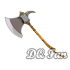
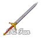

# ALL ITEMS of Dragon Quest I

## 📖 Table of contents

1. All Items
   - [Weapons](#weapons)
   - [Stuffs](#stuffs)
   - [Items](#items)
2.  [Return to Main Story]()

# Weapons

| Weapon      | ID           | Attack | Buy  | Sell | Function                                             | Location                     |
|-------------|--------------|--------|------|------|------------------------------------------------------|------------------------------|
| 

 | bamboo pole    | 2      | 10   | 5    | Young sprout used by children playing heroes...      | Radatome, Melkido            |
| 

   | club| 4      | 60  | 30   | Large wooden club, suitable as a weapon for beginners| Radatome, Garai, Melkido |
| 

 | copper sword   | 10     | 180  | 90   | Copper sword for those initiated into fencing     | Radatome, Garai, Maira, Rimuldar, Melkido |
| 

 | iron axe | 15     | 560 | 280  | Very good value for money, this axe will do wonders  | Garai, Maira, Rimuldar, Melkido   |
| 

 | steel sword | 20     | 1500 | 750  | One of the swords you will wear for a long time | Rimuldar, Melkido           |
| 

  | flame sword | 28     | 9800 | 4900 | Very powerful sword, can be used to create flames    | Melkido       |
| 

   | sword of roto   | 40               | -    | -    | The legendary sword of hero Roto   | Dragon King's Castle, second floor          |

# Stuffs
# Items
