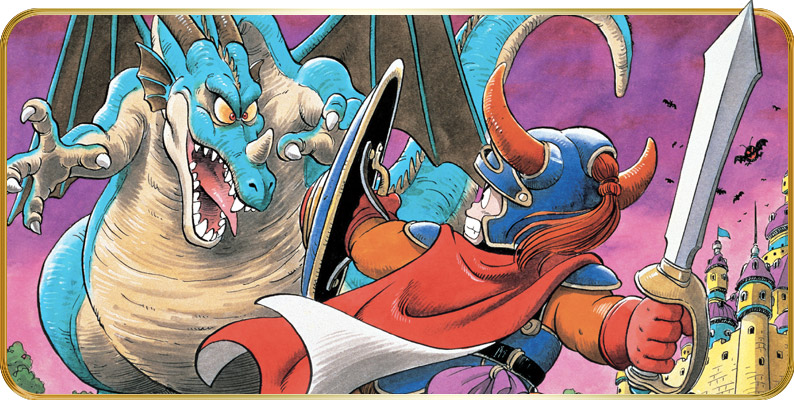
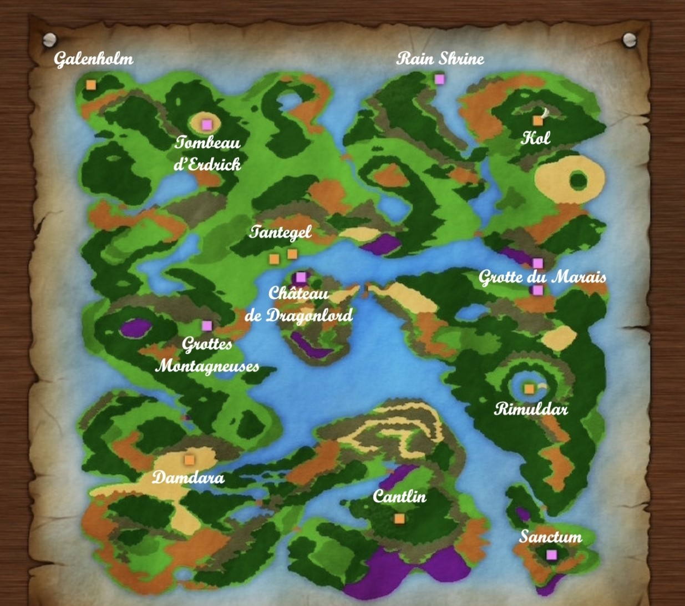

# Dragon Quest I

## 📖 Table of contents

1. Main Story
    - [Chapter 1: Delivering the Princess](#Chapter-1-Delivering-the-Princess)
    - [Chapter 2: Alena and the Journey to the Tourney](#chapter-2-Alena-and-the-Journey-to-the-Tourney)
2. Other
   - [Map](#map)
   - [Bestiary](#Bestiary)
  

# Chapter 1: Delivering the Princess

## Radatome Castle

The King receives you to explain what your quest will consist of. The King will tell you how far you've progressed in Dragon Quest I and how many experience points you'll need to reach the next level. After listening carefully, open the chests to obtain 120 gold coins, a torch and a magic key that will allow you to open the door to the South. You can also speak to the King's advisor, who will tell you about Princess Laura, and to the soldiers, who will give you lots of advice. Once you've done that, open the door and go down the stairs. In one of the jars to the east, you'll find an herb that will heal your wounds.
Now that you're ready to see the world, leave the castle and head for the town to the east.

## Radatome Village

PHOTO

First of all, head to the merchant to the north and buy the Club and Plain Clothes to equip yourself better. The Dragon Scales from the merchant to the east will also be useful, as will a torch or two. Next, you'll find a Wing of Chimera in a cupboard in the inn to the south. You can then start training so that you can stand up to the monsters of the world. Leave the town and wander the green pastures around the castle until you reach level 3/4, to obtain the 'Heal' spell, which heals you, and the 'Fireball' spell, which lets you shoot fireballs. Don't stray too far, fighting only Slimes or Red Slimes, and rest at the augerge regularly.
Once you've done that, don't forget to save the game by going back to talk to the King. You can also recover all your magic points by talking to the old man to the east of the ground floor. Now it's time to pay your respects at the tomb of your ancestor Roto, the legendary hero.

## Roto Cave

PHOTO

To reach his tomb, simply head north from the castle. You can find the entrance to a cave in a small desert, taking care of the surrounding monsters. Once you return, you will be able to breathe, you will not meet anyone there. Then light your torch to see something there, and head to the South-East, where you will take some stairs. There, walk the walls to Roto's tomb, and read his will. He will explain to you what you must do to defeat evil, namely find his sword and his legendary armor. Once done, return to town and rest. Fight until you have enough money to buy a Leather Shield and Leather Clothes. You are now well equipped to set off on an adventure. Onward to Garai!

## Garai Town

PHOTO

The town of Garai is located far north of Radatome Castle. Continue north after Roto Cave and head towards the western plains to reach it. This city is not very interesting at the moment, but you can still do some exploring there. It is therefore advisable to buy the Copper Sword there if you can afford it. The other amenities are still too expensive for you.... You will come back to this city later. After going around the town and talking to the inhabitants, you can either head towards the news that awaits you, or return to the castle to save, which we advise you to do.... Now, head to Maira!

## Marai Town

PHOTO

This town is quite far away, so be sure to be equipped as we have advised you, otherwise you will probably not come out alive... Maira is located to the east of the town of Garai. Starting from this, continue east then head slightly south to cross two bridges. After the second, head north. You will encounter the first monsters worthy of the name, like Sage or Giant Scorpion. Be very careful and do not hesitate to cast your "Fireball" spell. You should be able to see the town right in the middle of a forest. There you will discover on the ground, on a shiny point, the Fairy Flute, which will be obligatory for the rest of the adventure.

PHOTO

You can also find Plain Clothes as well as a Strong Seed in the shelves near the hot springs where a young woman offers you her "Puff-Puff" services... Use this seed immediately to develop your strength. After talking to the people present, go back... and train, until you reach level 8. All these fights will allow you to earn enough gold coins to buy an Iron Ax and possibly an Iron Armor. For the most motivated, it is also interesting to buy an Iron Shield in Garai but know that you can find one for free in the area we are going to describe: the mountain caves. Don't forget to save with the king and take advantage of this passage to go to the town of Radatome and store the Fairy Flute at the depot which will not be useful for a while.

## The mountainous caves

### Magic Nut
Mountain caves are easy to find and are an optional location. You don't have to do them now, or even after. However, we advise you to do so in order to find an Iron Shield! To do this, head to Garai by crossing the first bridge, then go south until you can't go down anymore, then head east. You should find some purple swamps, don't step on them or you'll get hurt. Continue east to find the entrance to the caves.

### Ground floor
As soon as you arrive, light a torch or use your "Radiant" spell. Then head west from the waterhole, go south then continue west as soon as you can. Then go north and you will see some pillars. Then continue east until you are blocked, then south. You will be stuck, go west then south. There will then be a crossroads with four directions, take the east one. Then follow the wall towards the south. You will eventually find a watering hole. To the west is a chest containing 343 gold coins.

Continue south then west. In this corner there is a door, you can ignore it, we will use another passage. Then head north until you find some pillars. Follow them, go along the wall and take the stairs.

### Basement
Once in the basement, head east, you can find chests in two recesses containing 537 gold coins and a torch respectively. Sometimes it is possible that in the first chest you will find the Cursed Necklace (one chance in thirty-two!). It has no use in the game aside from its very high selling price at over 1000 Gold. Continue east then south, where you can find a chest surrounded by torches containing a magnificent Iron Shield. To the west of this room is a second chest at the end of a beautiful red carpet, in which you can find the Warrior's Ring. Then continue towards the South-West to find a chest with a Strength Seed and a last one with a Magic Nut. Use them right away. Then exit the cave, either with the Outside spell or on foot. It's time to go visit the town of Rimuldar via the Marais caves!

Note: From this moment you will be able to equip both the Dragon Scales to have a defense bonus, as well as the Warrior's Ring to be more effective in attack. We recommend equipping both, but carrying both items at the same time will take up space in your inventory. So store the Fairy Flute in the Radatome town depot in the inn if you haven't already done so, or the Medical Herbs which will no longer be very useful to you since you learned to heal yourself with them. Magic.

### The Marais caves
These caves are located south of Maira, in the middle of a swamp. You will therefore necessarily lose life points before entering, be careful! They are very easy to navigate, no need to use a torch. Indeed, once inside, all you have to do is continue south until you get stuck. Then continue to follow the walls towards the south, then when you are blocked again, head towards the West to find stairs. Take them to get out of the caves. For the adventurers who have explored the cave, you may have found a door there that you will not be able to open for the moment, it can still wait a little... You are not yet ready for what is hiding behind!

## Rimuldar Town
Once outside, head west, go down a bit, then travel south through the forest. Watch out for the surrounding monsters that you find in the forests, which are quite strong, like the Wolf. If you encounter Iron Scorpions, use Fireball to defeat them, as they are very resistant to physical attacks. If you run out of magic, don't be brave and run away.

PHOTO

You will find Rimuldar on a peninsula. In this town you will obtain a Wing of Chimera in a wardrobe, next to a young woman changing... This town is very interesting and quite essential to continue the adventure because you find a Magic Keys merchant. You will thus be able to open the doors of the game, including that of the caves which we have already spoken about. To find it, when you are in Rimulda, do not enter the town straight away and continue north, where there is a lonely girl. Then continue west and you will find the entrance to the building.

Buy as many keys as possible (six maximum). Also search the pots in this store to get 120 gold and a Defense Seed to use right away. You can then use two keys to open the city gates to obtain a Nut of Life, which we advise you to use immediately too. Now it's time to see what lies behind the door of the rock caverns... But first, you need to prepare yourself physically. Save, and train diligently (the surroundings of Ridulmar are a good place) to reach level 11/12. Also buy a Steel Sword and a Steel Armor if you don't have one on you yet. Note that to the south of the city is the sacred temple, which currently has no use. It is therefore normal that you are teleported to its entrance if you try to speak to its guardian, a mysterious old man who patiently awaits the arrival of the descendant of the legendary hero...

## Return to the Marais caves
You should definitely save before venturing into these caves, as you may never return. It's time to save Princess Laura... So return to the rock caverns and starting at the top, follow the eastern walls and go down. You will be faced with a door that you can open with a Magic Key. Behind her is the Green Dragon! He is very powerful, and you will have difficulty defeating him if you are not well prepared. Here, brute force will be key, attack him constantly and heal yourself every three turns or so.

## BOSS
### Dragon

| PV    | Attack | Defense | Agility | XP   | Or   |
|-------|--------|---------|---------|------|------|
| 150   | 80     | 7270    | 45      | 900  | 250  |

**Information:** Use Fire Breath, keep the princess as boss

**Location:** Rocky Caverns

# Chapter 2: Alena and the Journey to the Tourney
## Return to Radatome Castle 

PHOTO

Once the princess has been rescued, talk to the King, who will thank you for your courage and for finding his beloved daughter. She in turn will talk to you and give you the "Princess' Love", which will tell you how to get back to the castle and how many experience points you have left before completing the next level using it. Now it's time to open the West door on the ground floor and open the chests containing an Agility Seed, a Magic Nut, a Magic Key and 342 gold coins. Then open the North-East door, where you'll find a key seller and a priest who can restore all your health points.

Next to the key seller is a passage to the south-east, in the grass. Take it and go down until you find a staircase. Take it. You'll meet a wise old man who will give you the Stones of Sunlight. Note that you can take a Herb and a Nut of Life from his cupboards, which we recommend you use straight away.

## Return to Radatome Town

PHOTO

To avoid using a useless inventory slot for too long, we advise you to take the Stones of Sunlight to the Radatome town depot, in the hostel. This will lighten your load a little. You can also now buy the Stones of Sunlight from a nun behind a door in the north-east of the town of Fairy Water. This item allows you to avoid fighting monsters for a while, which could well save your life during difficult moments in the quest.

## Return to Garai

PHTO

This is the second town you've visited, but this time you'll really understand its importance. Open the tower you find at the northern entrance to the town with one of your magic keys. There you'll find people warning you of the danger around you, so listen only to your courage and continue on your way. In the chests you'll find a Copper Sword, a Torch and a few gold coins. Once you've done that, head to the most north-westerly point in the room. From here, take a few steps eastwards, then continue northwards. You'll then find a secret passage in the wall, where you can continue towards an old man. Go down the stairs as soon as he disappears!

## Temple of the West of Maira

Treasure: Rain Cloud Staff

Return to save Ramatone Castle, then head towards the village of Maira. To the west of the village, you'll find a small passage between the mountains. Take it and head north until you come across a temple. Talk to the guardian there and he'll give you proof of your courage - the Silver Harp. When you show it to him, he'll give you the Rain Cloud Staff. You can store this in a town if that suits you. Now it's time to train to reach the last town: Melkido. You'll have to fight to reach level 15/16 and have enough money to buy a Steel Sword and a Magic Armor. If you run out of money, you can defeat the Gold Man near Rimuldar.

## The road to Melkido
Treasure: Fairy Flute, Defense Seed, Magic Key, Nut of Life

photo

Dragon Quest Melkido Town
The town of Melkido is home to some very interesting merchants. However, it is protected by an extremely powerful monster: the mythical Golem. However, it is possible to defeat it with ease. To do so, you need the Fairy Flute, which can put certain enemies to sleep. If you have it stored in the Radatome depot in the inn, go and get it. Once you have it, go to Garai and then south, beyond the Mountain Caves, cross the bridge and continue. Beware of the enemies here, they are quite powerful and you could die quickly.

Pass through the desert, but don't enter the town you see, you'll pass through there later. Instead, head south and then east. Cross the bridge, but don't take the second one. Make sure you remember this place, though, as you'll have to go back there too. This is where you'll come across some lucky Metal Slimes, who can give you over 775 experience points if you win! Continue north then east and you'll be able to see the town of Melkido in the distance. Cross the bridge that separates you from it, and prepare to fight the Golem. As soon as it starts, use the Fairy Flute. It will fall asleep for two or three turns, so take the opportunity to attack it, repeating the operation as often as possible.

## BOSS
### Golem

PHOTO

| HP   | Attack | Defense | Agility | XP  | Gold |
|--------|---------|---------|---------|------|----|
| 150-160| 120     | 60      | 40      | 2500 | 10 |

**Informations**: Very sensitive to the Fairy Flute, guards the town of Melkido
**Location**: In front of the town of Melkido

Once defeated, you'll gain almost 2,500 experience points! Now it's time to return to the famous town of Melkido. Here you can pick up your stored items, drop off others and buy some very valuable items. You'll find a Defence Seed in the inn's wardrobe. A Magic Key can be found in a cupboard that can be opened behind one of the closed doors. A Nut of Life is also waiting for you near the holy water vendor. We advise you to buy the Flame Sword and the Mirror Shield as soon as possible - if not immediately - and to pass level 17/18.

## The devastated city of the desert
Treasure: Armor of Roto

photo

It's time to set off in search of Roto's legendary armour. We'll start with his famous armour, which is said to have once made him invincible. To do this, head for the desert you crossed on your journey to Melkido, south of Garai. You'll find a devastated town, with no living soul apart from some fairly powerful monsters. So remember to heal yourself regularly. When you enter the town, go around the first building to the south and then east. When you can't go any further, head north near a small row of trees, then from there head west across the poisoned water. Watch out, you're going to have to fight a boss! Make sure you're in good shape before you take him on, or he'll quickly take you down... You'll come across a Demon Knight. He has the power to put you to sleep with his Sleep spell, so prevent him from being invoked from the start by using your 'StopSpell' magic. Heal yourself as soon as your health points drop below 60.

## BOSS
### Demon Knight

| HP   | Attack | Defense | Agility | XP  | Gold |
|------|--------|---------|---------|-----|------|
| 80   | 90     | 90      | 50      | 120 | 160  |

Once defeated, continue westwards, and when you reach the end, dig through the grass to find the Armor of Roto.

PHOTO

Armor of RotoThis will heal you with every step you take, and you'll have nothing to fear from the swamps and other poisonous waters. A true blessing!

## The descendant of Roto
Treasure: Token of Roto, Rainbow Drop

Now you have to prove your status as a hero, and as a descendant of Roto. If you decide to go to Melkido, a character will show you some coordinates. These are the coordinates where the Token of Roto can be found. As the princess is with you, you can talk to her to find out how much experience you have left until your next level, as well as your coordinates in relation to the castle. You must then go to the coordinates indicated by the NPC, with the help of the princess. This conversation with the NPC and the help of the princess are not compulsory if you follow this solution.

Remember the bridge you didn't use near Melkido, now's the time to do it! After crossing it, you should find an absolutely gigantic swamp. It's made up of two large parts, separated by a tiny patch the size of your character. From here, head east and take about twelve steps. Watch the ground with each step and you should find the Token of Roto. To help you, you can use the Princess Love. When you use it, you'll get i

photo

Once you've done that, take the Stones of Sunlight and the Rain Cloud Staff from your inventory. Head for Rimuldar, then the south of the town, until you come to a temple. Talk to the old man there and he'll integrate your two items to create the Rainbow Drop. Be careful, you must have the Token of Roto for him to agree to help you.

Return to Rimuldar, then go to the most north-westerly point of the continent you're on, in a desert. You should be directly opposite another continent, separated from it by a small stretch of water. Use the Rainbow Drop on the end of your land area to create a Rainbow Bridge, allowing you to reach the continent of Lordragon Castle.

## The Lordragon's lair
### First Floor
Be very careful of the monsters in this last dungeon, as they are, as you might expect, very powerful. Be particularly wary of the Hades Knights and the Demon Knight, and their Sleep spell. You should also encounter many types of dragon, so heal yourself regularly to survive the many battles ahead. When you return, take the West passage and head for the throne room. Take a look at the throne room and you'll see that there's a small draught behind it... Go and look behind the throne to discover a secret passage.

### Second Floor
Open the door before you and follow the southern passage until you have a choice of two paths. Take the one to the East, then continue until you find the stairs leading to the top floor.

### Third Floor
Once you're on this floor, you can go North or West, so take the passage leading West. Continue along this path until you are again presented with a choice: take the passage to the East and take the stairs you come across.

### Fourth Floor
Treasure: Dragon Quest Chest Treasures: Gold coins, Herb

To the west are two chests containing gold coins and a Herb. Collect them, then take the passage to the east, without taking the first staircase you come to. Continue this way and head south to take the stairs...

### Fifth floor
Head south into the small hollow containing a number of torches. Take the first staircase you see.

### Back to the fourth floor
Head south-east and take the stairs.

### Back to the third floor
Take the stairs you will see when you arrive in the East.

### Back to the second floor

Treasure: Sword of Roto

Open the chest you see to acquire the Sword of Roto. Equip it immediately! Once you've done that, we recommend you return to Radatome Castle to save your equipment and prepare for the final confrontation. Buy the Mirror Shield if you haven't already done so, and train until you reach at least level 20. The time has come for you to face your destiny.

## The final assault
### First to fourth floor

Take the same route as before to reach the fifth floor.
### Second Floor

Open the door in front of you and follow the southern passage until you have a choice of two paths. Take the one to the East, then continue until you find the stairs leading to the top floor.

### Fifth floor

You're back in a familiar room... Don't take any of the stairs near the torches, but instead continue to the south-east of the room. Once you've passed this passage, continue north where you should find a staircase surrounded by pillars. Note that the second staircase near the torches leads to an infinite loop, the first of its kind in an RPG!

### Sixth floor

Follow the only path open to you, keeping an eye out for Darth Dragons and other dangerous monsters you might encounter...

### Seventh floor

Keep walking eastwards from your starting point, and you should come across some stairs in front of you. Climb them...

### Eighth floor

Treasure: Cursed Belt, Magic Nut, Herb, Magic Key, Gold coins, Wing of Chimera

You have now reached the top floor of the castle. Head north and you'll find a room containing several chests. You can obtain a Cursed Belt, a Magic Nut, nue Herb, gold coins, a Wing of Chimera and a Magic Key. However, these items won't be of much use to you for the rest of the story, apart perhaps from the herb. Return to the corridor that led to this door and take the passage to the west, then continue to the north-east. This will take you through a large room as well as a section with grass and poisoned water. You will then be confronted by the Lordragon. Don't be tempted by his offer to rule half the world, and answer "no" twice. The battle will then begin. His first form will be fairly easy to defeat if you're well prepared: heal yourself as soon as your health points drop below 100, and only use physical attacks or Firebane to attack him. Roto's sword will prove its worth in this fight.

## BOSSES 
### Dragon King (Human)
| HP       | Attack | Defense | Agility | XP | Gold |
|----------|--------|---------|---------|----|------|
| 200-250  | 105    | 110     | 50      | 0  | 0    |

**Informations**: Uses Healmore, Firebane, and can put you to sleep with Sleep
**Location**: Castle of the Dragon King

After this fight, he will show his true nature: that of a great dragon. Continue as you did in the first fight, and you should come out of it with little difficulty. Watch out, though, for his fire breath, which does a lot of damage... After a fierce battle, you should be able to get the better of him.

### Dragon King (Dragon)
| HP       | Attack | Defense | Agility | XP | Gold |
|----------|--------|---------|---------|----|------|
| 250-350  | 110    | 110     | 50      | 0  | 0    |
**Informations**: Spits a blast of fire and can increase his agility
**Location**: Castle of the Dragon King

## The end of a quest
Once Lordragon has been defeated, you can restore the Ball of Light... the source of all life. Peace has finally returned, and no more monsters will attack you. Make the most of your victory by visiting the towns and cities, to gather the various reactions of the villagers, who will pay tribute to the new hero that you are. Return to the castle, where the King awaits you, and you'll be offered a most interesting proposition... which you'll refuse, to create your own kingdom, alongside Princess Laura, who will ask you to accompany her. Accept, and admire the end of the game... Congratulations, you've completed your quest... Dragon Quest!

# Map 

