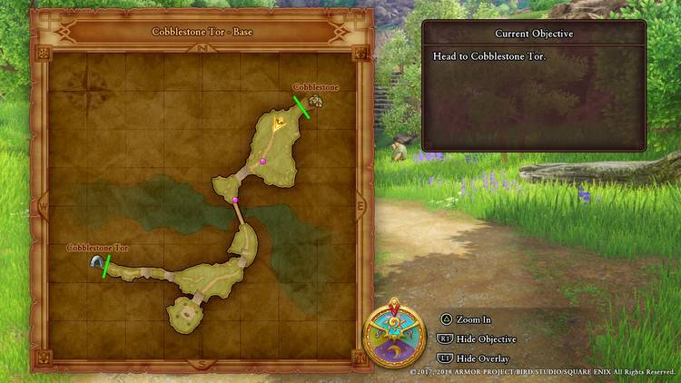
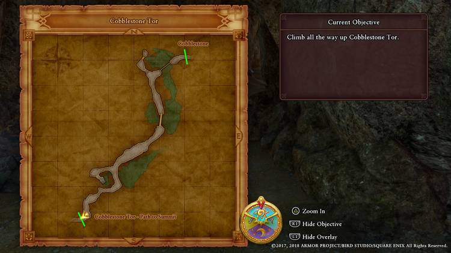
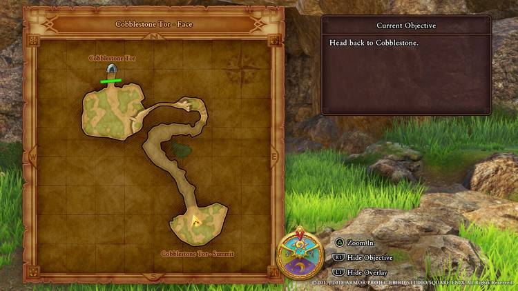

# Dragon Quest XI: Chapters of the Chosen

## 📖 Table of contents

1. Main Story
    - Act 1
      - [Chapter 1: Coming of Age](#chapter-1-Coming-of-Age)
      - [Chapter 2: Adventure Awaits](#chapter-2-Adventure-Awaits)
      - [Chapter 3: Power of the Luminary](#chapter-3-Power-of-the-Luminary)
      - [Chapter 4: Terra Incognita](#Chapter-4-Terra-Incognita)
      - [Chapter 5: Gallopolis](#Chapter-5-Gallopolis)
      - [Chapter 6: New Horizons](#Chapter-New-Horizons)
    - Act 2
    - Act 3
2. Sides Quests
3. Other
   - [Map](#map)
   - [Bestiary](#Bestiary)
   - [All items by Shops](All_items_by_Shops.md)
   - [Best team sets]()

# Main Story
## Act 1
## Chapter 1: Coming of Age
After you have named your character and experienced the opening cutscene, you will find yourself at the foot of Cobblestone Tor with your childhood friend, Gemma, and your dog, Sandy. The first thing you should do is open up the pause menu (Triangle button) and select "Equipment" so that you can equip the Trodain Bandana and Trodain Togs which are better than the Plain Clothes that you start with. You may also choose to swap your one-handed sword for a two-handed greatsword.

Note the pink dots - these are people with something significant to say. They will be marked in the game world with an "!" above their heads. Follow Sandy and talk to the woman. Head up the stairs and talk to Dunstan, the mayor, and Amber, your mother, standing by the footbridge. Cross the bridge to find yourself in your first battle against three slimes. Sandy will help you fight them, although they're not exactly hard - you can take them out with one whack from your greatsword. Gemma will occasionally toss phials that will heal you. Before following Sandy towards your objective, go up the stairs to your left and look behind the shrine to find a chest containing a Pot Lid which you can equip in your off-hand if you're using a one-handed sword. Follow Sandy into the cave.

### Cobblestone Tor - Cavern

Cross the log bridge and climb up the rock wall to your right to find a sparkling spot by a tree which gives you a Medicinal Herb. Go back down an continue further into the cavern to receive a tutorial on initiating combat. Basically, always use the X button when you see the orange arrow so that you begin combat on your terms. Eliminating all the slimes around here should give you your first level up and unlock your first spell, Frizz, a mildly damaging fire attack. Cross the next bridge and continue into the cavern, eliminating enemies on your way. Here you'll encounter your first needler enemies which are somewhat tougher than the slimes, but still nothing to worry about. When you reach the fork, turn right and go down the steps to find a couple of pots you can smash for minor loot. Return to the fork and continue deeper into the cave. Be on the lookout for a sparkly spot on the right which gives you a chunk of copper ore. Fight the last batch of enemies and exit to the next area.

## Cobblestone Tor - Face

After the cutscene, you will have a mini-boss battle against a pair of smogs. While they are much tougher than the other enemies you've encountered so far, particularly with their fiery breath attack, Gemma's intermittent healing should mean that you have no real problems defeating them. You should gain another level as well. Look behind a tree to the left of the area to find a piece of pink pine. At this point you should receive your first accolade, Amateur Itemologist.

There's nothing else to do here, so shimmy up the nearby rope. Make your way over the ledge, climb down the rope (or jump - it's quicker) and clamber up the rock face to proceed to the summit. After the cutscene, examine the area for another piece of pink pine by a tree, Enter the cavern again to automatically return to the foot of the tor.

## Cobblestone Tor - Base
Make your way towards Cobblestone Tor. On the way, you will encounter the mayor after which you will receive the Coming of Age accolade (and the trophy of the same name if this is your first playthrough).

## Chapter 2 - Adventure Awaits
