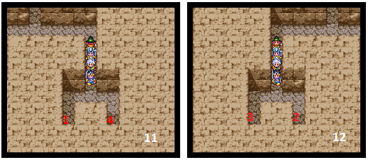
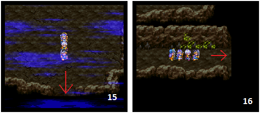

# Dragon Quest III

## 📖 Table of contents

1. Main Story
    - [Chapter 1: From father to son](#Chapter-1-from-father-to-son)
    - [Chapter 2: The hero's arrival](#chapter-2-The-hero-s-arrival)
    - [Chapter 3: The charms of orients](#chapter-3-the-charms-of-orients)
    - [Chapter 4: Searching for the supreme key](#Chapter-4-Searching-for-the-supreme-key)
    - [Chapter 5: The first orbs](#Chapter-5-The-first-orbs)
    - [Chapter 6: With or without companions](#Chapter-6-With-or-without-companions)
    - [Chapter 7:]
    - [Chapter 8:]
3. Other
   - [Map](#map)
   - [Characters](Characters.md)
   - [All Items](All-Items.md)
  

# Prologue
Once you've entered your nickname and selected your gender, you'll be asked a series of questions to find out what kind of person you are. Once you've done this, you'll be sent to a place where you'll have to emerge. It won't be difficult, but it will once again help to define you. Once all these tests have been passed, the voice that asked you so many questions will be able to tell you what your personality is... It is at this point that your mother pulls you out of this strange dream.

# Chapter 1: From father to son

## Aliahan Castle
It's the first day of your sixteenth birthday. Once your mother has left your room, open the bedside table drawer and pick up a strength seed. Then join your mother, who will order you to follow her to the King's castle. Do as she asks and go to see your sovereign in the castle. During your audience, you will learn that your father, the hero Ortega, died in battle. 

The king asks you to take up his quest where he left off, to kill the demon Baramos and restore peace to the world. To get your adventure off to a good start, the king will give you weapons, armour and 50 gold coins.
Now it's time to search the castle. From the throne room, enter the room at the bottom left of your screen and open the second drawer, which contains a Luck Seed. You can then go back down to the ground floor. Sneak into the wing.
You may have noticed that you can't open certain doors. These can only be opened when you have the corresponding keys. Don't worry, we'll find those keys later in the adventure. In the meantime, get out of the castle. Now we can search the town.
Start by returning home. In the first barrel on the ground floor is a medical herb. Upstairs, go into the room of the old man, your grandfather, and open his drawer, which contains 5 gold coins.

Go to the south-east of the town and you'll see a well. Go inside, then go through the door of the house there. This is the Medal King's Mansion. This is where you can exchange the small medals you've found for rewards. A book in the library will tell you what rewards are available.

You can now open the barrel located to the north-west of the town next to the tavern. You can reach it by going around the tavern. The barrel contains 25 gold coins. Then enter the tavern. This is a very important place, as it's here that you'll be able to shape your team. What's special about this episode is that you can choose your travelling companions, as well as their jobs. Jobs allow characters to specialise. So you can create several characters on the floor that might be of interest to you (you can boost their stats with five free seeds for each character you create). To add them to your team, you'll need to hire them from the stand on the ground floor. To get the adventure off to a good start, we recommend that you take a mage and a cleric with you.
### The night
In the house to the east of the town, you'll find a 'small medal' hidden in one of the drawers upstairs.

## Najimi Tower
This is on the island to the west of your castle. To reach it, you will have to cross a cave. You can reach the entrance by following the shore of the inland sea to the west.

photo

You'll find a medical herb in a hidden corner of the cave, as well as traveler clothes and 56 gold coins. In the basement of the tower, a chest contains 32 gold coins in a hidden area to the north. Then reach the ground floor via the south staircase. Continue upwards, and if you're feeling too weak, take a trip to the inn in the tower. Otherwise, enter the hidden area to the east and go upstairs.

photo

On the first floor, the chests will give you 40 gold coins and a small medal. To get to the second floor, take the stairs to the south-west in a hidden area. Enter the hidden area behind which is the staircase that leads to the old man who will give you the thief key. Search his bookcase too, as it contains a Tomboy book. You can now leave the tower or open the doors to the basement, behind which are an agility seed and a wooden helmet. You can also open some of the doors to Aliahan Castle (where you'll find a small medal).

photo

## The village of Reeve
You can reach this village by heading north-west. Let's start by searching the area from top to bottom. You'll first find a muscle book in the library of the house to the north of the village.

photo

Then enter the detached house to the north-east of the village. Look in the pots and you'll find a wisdom seed. Go upstairs and speak to the old man so that he can give you the magic ball. Don't forget to look in his bedside table, where you'll find a herb antidote.

photo

You can now leave the Aliahan region. To do so, head south-east. Start by entering the house on the plain. Inside you'll find a 'wing of chimera' and a 'small medal'. Then enter the ***Cave of Enticement***.

photo

## Cave of Enticement
On the first level.Stand in front of the wall between the two statues and use your magic ball.The wall will explode, clearing the way for you. Open the chest just behind the wall (or what's left of it), which contains an important item: the magic map.Then take the stairs.Make your way to the far north of the level, then enter the hidden area to the west to get the herb antidote.Finally, enter the eastern hidden area to continue towards the exit. Once you've left the exit, search the various hidden areas on either side of the wall for a ***sacred knife***.

photo

Once you've done this, head for the northernmost hidden area. Inside, take the stairs leading downwards.There are now three paths open to you. Only the one to the west will allow you to leave the cavern. To do this, take the teleporter. This will take you to the exit staircase. You will then arrive at Romaly Castle. Go there.

photo

# Chapter 2: The hero's arrival

## Romaly Castle
The town has its share of treasures, so it's worth taking the time to explore. You'll find an antidote herb and a full moon herb in the drawers of the inn. You can also pick up a hard heart and a smart book in the church. Finally, in the house to the west of the town you'll find a small medal and a leather hat.

The castle contains only a 'Pachisi ticket' and a 'cheater guide'. You'll find these two items in the king's father's room at the top of the castle's north-east tower.

You must now head north to Kazave. On your way, you will see an isolated building. This is actually a building where you can use your Pachisi tickets to play a life-size game of dice. Access has already been granted, so don't hesitate to take a look around. Finally, to reach Kazave, continue north.

photo

## The village of Kazave
In this village, you'll find a number of items, including a Pachisi ticket in the inn and boxer shorts in the house to the east of the village. Finally, a secret passageway contains a life nut and a fur hood. To reach this passage, simply go behind the tavern to the north-east to reach the staircase there.

### At night
You can open the two chests in the item shop. They contain a poison digger and a club.

## Shampane Tower

You must now go to the Shampane Tower to defeat Kandar and take back the Golden Crown. This tower is to the east of Kazave. To the east of the ground floor is a chest containing 430 gold coins. There is no chest waiting for you on the first floor. Go to the second floor via the staircase in the hidden area to the north of the first floor.

photo

On this floor, head for the hidden area to the east, where there is a chest. It contains a bronze shield. Now go to the hidden area to the north of the floor to get to the third level. Now open the large door to the south and climb the stairs. Then approach the thieves and follow them. You will see Kandar, but he will manage to escape. Go back the way you came until you find him on the third level of the tower. Confront Kandar. Once defeated, pick up the golden crown and return it to the King of Romaly. He will then offer you the chance to become the new king. You can accept for the fun of it, but you won't be able to continue the adventure, so you'll have to give the throne back to the old king. You'll find him fighting monsters in the basement of the armoury.

Then take the road north of Kazave to the town of Noaniels (5). The elves have placed a curse on the town, putting all its citizens to sleep. Your duty is to wake them up. To do so, you must go to the hidden elven village to the west of the sleeping town (6). Don't forget to search the sleepy town from top to bottom, because in the house to the north-east you'll find a strength seed in the cauldron. In the pot in the house to the south-west, you'll find an agility seed, as well as a tragic tale in the library upstairs. Finally, you can collect a 'full moon herb' and a 'leather kilt' in the NIC.

photo

The welcome you will receive in the elven village will be far from warm, but you will learn from the queen that in order to destroy the spell on the town of Noaniels, you must bring her the 'Dream Ruby'. This can be found in the cave to the south of the village.

## The cave south of the elf village
Start by heading south. In the first hidden area to the west, you'll find a chest containing 288 gold coins. In another hidden area along the way, you'll find a holy water. Then enter the southernmost hidden area (7) and take the stairs there. Continue down one floor and open the chest in front of you. It contains a "small medal". Continue down all the stairs going up. You will then come to a staircase going down (8). Take it.

photo

Go around the water (9) to restore your health and magic points. Continue on your way by entering the hidden area to the west of the water. Then head north and enter the two hidden areas there. The one to the east contains a "strength seed". In the one to the west, you'll find an iron spear. Turn around and head west. Take the staircase (10) leading to the lower floor.

photo

Next, to the east, you will see a new staircase leading to the lower level. Don't take it, but head down the path to the south and enter the hidden area on the right, where a chest contains a silver rosary. Retrace your steps to the staircase and continue west. Go up to the north and enter the hidden area (11) there and grab the 224 gold coins lying in the dead end. Come out and continue south. You will then be able to cross two hidden areas. Start by searching the southernmost one, which contains a chest with a "Pachisi ticket". Then enter the area a little further north. There's a chest containing a leather dress and a staircase you'll need to take. Cross the bridge and take the contents of the chest (12), which is the Dream Ruby. You can now leave the cave.

photo

Return to the hidden elven village and give the Queen the Dream Ruby. She will then give you the Wake-up Powder. Return to Noaniels and use this item to wake up the town.

# Chapter 3: The charms of orients

## Heading east!
Your route will then take you eastwards. From Romaly, head east to cross a bridge (1) and reach the town of Ashalam (2).

The town of Ashalam
You'll find a moth powder in a cupboard in the inn. Finally, some merchants will have a different business sense to the usual. So, when you want to buy one of their items, you can refuse the price offered by the merchant, who will then make you a better offer. In reality, he will agree to halve the starting price and you will be able to refuse his offers three times over. In the end, you will only have to pay a quarter of the starting price if you manage well.

### At night
A woman in the centre of town will offer you her special services, in fact she'll give you a puff-puff session. You'll find a 'Pachisi ticket' in the cupboard of this young woman's house. Finally, an arms dealer opens his doors only at night. His weapons are more powerful than what you'll find in the town's other shops.

You must now set foot in the desert to the west of Ashalam. On your way, you'll see a building in the middle of a forest (3), a Pachisi castle where you can play with Pachisi tickets. Once you're level with the desert, head south and you'll see an oasis (4). Enter it, as this is where you'll find the kingdom of Isis (5).

## The city of Isis
You'll find a pair of boxer shorts in the house to the north-west, a small medal in the pot in the armoury and a brave book in the well. Finally, you will find a small medal buried in front of the middle cross in the cemetery, as well as an agility seed buried to the left of the well. You can also have fun in the monster arena by betting on a monster.

### At night
A 'Pachisi ticket' is hidden in the pouch hanging on the wall of the house just to the right of the inn. Finally, upstairs in the same house, you'll find a 'smart book' in the Socrus library.

## The Castle of Isis
Access the basement by standing behind the outer columns to enter the western entrance to the palace (6). Follow the only path in front of you and you will come to a chest containing the starry ring. Don't worry about the ghost, just answer his questions (7).

You can then enter the palace through the classic opening. On the ground floor you'll find a "defy book" and a "Pachisi ticket". You can then visit the queen, whose throne is upstairs. Then go to the house south of the desert, where you'll find three items: a small medal, a Pachisi ticket and a Tomboy book. You must now explore the pyramid (8) to the north of Isis. Go there.

## The desert pyramid
Go down the main corridor and take the second corridor on the right, then follow it and go upstairs using the staircase (9) at the end of the passage. Make your way through the labyrinth so that you can take the staircase to the north-west of the floor (10), which will take you to a small medal.

After returning to the first floor, head directly south and you'll come across a chest containing a wisdom seed. Then find the south staircase which leads to the second floor. This is where you'll find the magic key, but it's guarded by a door. To open it, you'll need to press four buttons, but in the right order.

Here's how it works: From the staircase you arrived at, head east and open the first button (11), then head west and press the second button (12), then the third which is right next to it (12), and finally the fourth in the east, next to the first button.

Place yourself on the numbers in the correct order.
The door to the north will open. Enter the room and open the chests, which contain a "stamina seed" and the "magic key".Then go up to the next floor and use the magic key to open the door guarding the treasure room.The chests contain: 176 gold coins, a wing of wyvern, a strength seed, 80 gold coins, an agility seed, 112 gold coins, a magical skirt, 304 gold coins, a ruby ring, 56 gold coins, a small medal and a stone wig (cursed object).Beware, however, as each of the chests will be guarded by a group of four mummy men. Reach the next floor, where you'll collect a flashy suit. Go to the top floor, which is the roof of the pyramid, and rummage around for the small medal hidden there. Now leave the pyramid.

You can now open every door except the prison doors. So don't hesitate to go back through towns you've already visited to access new areas. You can now reach the isolated building (13) to the west of Romaly. This is the passageway to the town of Portoga (14).

## The town of Portoga
In the building containing the inn, the armoury and the item shop, you will find a "Pachisi ticket" and a "strength seed".Go to the castle, where the treasure room contains a 'mist staff', a 'stamina seed' and an 'angry tattoo'. Finally, talk to the King and he'll give you the King's letter. This will allow you to move east.

As you can see, you need to reach the lands to the east. To do this, enter the cave (15) to the north-west of Ashalam. Make your way to the dwarf Norud (16). First take what's in the chest, i.e. a training suit and a club. Then give Norud the King's letter. He will then unlock the secret passage to the east.

# Chapter 4: Searching for the supreme key

## Exiting the Nordud tunnel
Once you have exited the Norud tunnel, head south until you reach the town of Baharata (1).

## The town of Baharata
You'll find a 'traveler clothes' on the floor of the shop that normally sells pepper, a 'Pachisi ticket' in the south-west house and a 'small medal' in the inn. Once you've collected these items, talk to the old man (2) in the south of the town. He'll ask you to rescue his daughter who's been kidnapped.

Your task is to go and find the old man's daughter and son-in-law, who happens to be the pepper seller. Leave the town and enter the cave (3) to the east of Baharata.

## The eastern cave of Baharata
Start by heading north to the far north-east of the level (4). There are two chests in front of you. Open the one on the right to find 352 gold coins, while the one opposite contains a cannibox. Continue westwards and you'll come across a chest containing a small medal. Continue west and you'll come across two more chests. The one at the top contains 132 gold coins, while the one on the left contains a cannibox. Take the large door, then head west and finally south. Open the door in front of you and enter. A chest containing a "stamina seed" will be waiting for you to open it. Finally, complete this level by continuing eastwards. You'll come to a staircase (5), take it.

Then head down the corridor to the west and enter the room to the north, which is guarded by a door. You will find four chests, each containing a seed. Go back the way you came, then follow the corridor to the south, open the door at the end and enter the room. This is the room where the kidnappers are. Before you go any further, four Henchmen will challenge you. Shoot them and then search the satchel hanging on the west wall. A "Pachisi ticket" is inside. Then head north to free the hostages by lowering the levers. Then follow Tania and Gupta. Kandar and his henchmen are preventing you from leaving the cave. Prepare for battle.

Kandar will be accompanied by two Henchmen. First, disable his two henchmen. If you have a cleric, use his support spells. Once Kandar has been defeated, return to Baharata.

Go to Gupta's shop and he will offer you some pepper. Return to Portoga and give the pepper to the king. He will recognise your bravery and offer you a boat, which you will find in the town harbour. Take your new means of transport and head for the village of Tedanki. To do this, follow the west coast of the land opposite Portoga until you can enter the interior via a river (6). You'll then quickly reach Tedanki (7).

## The ghost village of Tedanki
If you arrive during the day, you'll notice that the town is deserted. Come back at night and the inhabitants will be there. You'll find 55 gold coins in a cauldron. A darkness lamp and a black hood are hidden in the armoury upstairs, but you can only access them during the day. An old man will tell you that you can find information about the 'final key' in Lancel. On the island (8) to the south, you'll find this village (9).

## The village of Lancel
In the big house to the west, you can collect a 'Pachisi ticket' and 5 gold coins. Go to the item shop and buy an 'invisible herb'. You'll need it to enter Castle Edinbear, your next destination. To reach Edinbear Castle, head north-west to reach the small island (10) that houses the castle (11).

## Castle Edinbear
A soldier will refuse to let you pass. Use an invisible herb to clear the way. Once inside, find the lady manual, a slick suit and a party dress in the royal bedroom. Then enter the basement, where you will be put to the test. You will have to move rocks (12) so that they are placed side by side (13). A passage will be opened behind which is the "thirsty pitcher". You can now leave the castle.

Return to the sea and head west, stopping near a coastal forest where there is a clearing (14). Enter the clearing. There you will meet an old man. He will tell you that he plans to create a town here, but needs merchants to do so. Return to Aliahan, recruit a merchant and offer him to the old man.

Once you've brought the merchant to the old man, look for the Sioux town (15) in the middle of this continent. Enter the heart of the continent in your boat by crossing the different branches of the flowing river.

The Sioux village
Start by going down to the well, where you'll find a Pachisi ticket. In the house to the north, you'll find a small medal in a pot, and an agility seed in the pot in the house to the south. You'll also find a bolt staff buried in front of the well.

According to the information you have gathered here, you need to head west into the sea to find the Shoals (16 and 17). When you get there, use your thirsty pitcher. A building will emerge from the water. Go inside. A chest awaits you, containing the final key. You can now open all the doors!

# Chapter 5: The first orbs
## The Green Orb
Now that you have the final key, you can open the doors that have been closed to you until now. Start by returning to Tedanki at night and opening the prison door guarding the prisoner. Talk to the prisoner and he will give you the green orb. Then go to the island of Greenlad (1), and enter the meadow in the middle of the snow (2). Find the magician's hut. Inside, you'll find a silk hat and a small medal. Finally, talk to the magician.

Go to Dharma (3). This is where you can change the class of your characters. Then go to Garuna's tower (4). Reach her by walking north.

## Garuna Tower
On the ground floor, you'll find a wisdom seed in a chest in the hidden area to the south. To get to the next floor, take the staircase (5) to the north-west of the ground floor, then balance on a rope and reach a teleporter, which you'll have to cross. You will then arrive in a room (6) with three staircases.

If you take the top one, you'll come to a chest containing 448 gold coins. The bottom one leads to a 'small medal'. To continue, take the stairs on the right. Then head south and take the stairs there, continuing until you reach a second rope. Cross the rope and take the stairs up. This will take you to a silver bar. Go back the way you came and purposely fall off the second rope where you first crossed it. This will take you to the 'zen book', an essential item for making your mage (if you have one, which is advisable) a sage in the Dharma temple.

You must now go to the village of Zipangu. You'll find this village (7) to the east of Dharma. It is located on an archipelago resembling the Japanese archipelago.

## The village of Zipangu
You'll soon realise that the village is in crisis. A monster living in a cave near Zipangu is devouring the women of the village who are offered to it as sacrifices. If you kill the monster, she'll give you the orb.First find the various items scattered around the village. You'll find clothes in the house to the south, a strength seed and a small medal in the underground storeroom. Finally, you'll find a mystic nut and a moth powder in the house to the north-west, and a wooden helmet in the house to the north-east. Then enter the temple to the north of the village. There you'll find a mystic nut, a strength seed, a small medal, a scale shield and a training suite. You must now go and defeat the monster in the cave near Zipangu. If you need to restore your health, you can rest at an inn north of Zipangu.

## The Zipangu cave
Head west first, then south, and you'll find an all-knowing mask in a hidden area. Then take the only staircase on this floor and enter the hidden area to the east to challenge Orochi.

This boss will perform each of his turns with usually two attacks, most often a firebane combined with a classic attack on one of your characters. As usual, use your support spells and attack with your warriors. However, don't forget to heal yourself regularly, as this is a long and difficult battle that will require stamina, as Orochi has a lot of health points. Once you've defeated him, he'll leave you the Orochi sword.

Leave the cave by taking the teleporter in place of the monster, which will take you back to the temple. Once you're in the temple, regenerate as it's far from over. Speak to the woman lying on the ground - as you'll have guessed, it's Orochi in human form - and a new battle will begin. Orochi will have fewer hit points but is still a formidable opponent. So use the same strategy as in the first battle and you'll get the better of her. Next, open the chest she leaves behind. It contains the "purple orb".

Now go to the town north of Zipangu called Muor (8).

## The town of Muor
The first thing you'll find is a leather kilt in the inn. Then go upstairs in the large building to the north-east via the staircase behind the counter. You will find the staircase behind the building (9). You will then find Popota (10). On this floor, you will also find a "small medal" and a "Pachisi ticket" in the pots. Talk to Popota and he will agree to give you your father's helmet. The helmet will be returned to you by the merchant when you come down from the floor.

Next, go to the tower to the east of Muor. You can reach this tower (11) easily by boat.

## The east tower of Muor
Start by opening the door to the north (12), then head either east or west, then open another door (13) and enter the hidden area where you can choose between four staircases.

Take the north-west staircase to enter the hidden western area (14). Take the stairs there and then the next one. Then take the north-west staircase (15).

Cross the ropes to the south-west and open the two chests (16) there. One contains a "small medal" and the other a "benevolent ring". Go back to the ropes and stand in the middle of the canvas (17), then drop down. You will come to a platform containing four chests. They contain 552 gold coins, a small medal, a life nut and the echo flute. You can now exit.

Now find the pirate village. To do this, head south from the tower you've just explored. You will arrive at the village (18) after rounding the southern cape.

## The pirate village
Before entering the village, go around the palisade to the right. You will then see a rock. Push it aside, launch a search and a secret passage will be revealed. Inside you'll find a "strength seed", a "rockstar ring" and the "red orb". You can now enter the village. On the ground floor you'll find tube socks, two Pachisi tickets and a small medal.

## The night

The pirates are back, so don't hesitate to talk to them to gather information.

# Chapter 6: With or without companions

## Back to Lancel
Return to Lancel and head north (1) to discover the hidden side of the town. Open the central door, then speak to the priest (2).

You will then be presented with a challenge. Once you've accepted it, you'll be on your own as your companions will have to stay away. After following the priest, head east and open the chest containing a "small medal" (3). Then head west. This will take you out of the town. Enter the cave to the west (4).

## Lancel's western cave
Move south and open the door in front of you (5). Then head further south. In the two hidden areas to the west, you will find a chest containing 248 gold coins and a mimic in the other. In the two hidden areas to the east, you'll find two chests containing a small medal and a wisdom seed respectively. Finally, continue heading south (6), then follow the only path available to you until you reach a staircase leading downwards.

Now head east and you should find a staircase leading up to the terra armor. Go back up and head north, where you'll find a staircase leading down. Use this to go down to the lower level. Then climb northwards and follow the path without worrying about the heads hanging on the wall. They'll try to distract you, so don't take any notice. You will then come to two chests (7). One contains a "small medal" and the other the "blue orb" (8).

Leave the cave, go back to the city and take your companions with you. Visit the old Sioux and the merchant you left with him. You'll see that the place has changed. Visit them from time to time. As you visit, the town will change.

Now you need to get to Samanosa Castle. To get there, you need to enter the isolated building (9) on an island to the north of the new town started by the old Sioux. Once inside, take the northernmost teleporter. You will then come to another building, so enter the teleporter (10) just above the one you came in on. Exit and head west to Samanosa Castle.

## The town of Samanosa
All you'll find here is a 'Pachisi ticket' in a barrel outside, as well as a 'strength seed' in the big house. If you talk to the locals, you'll soon realise that the king is not very well liked. Find out more by visiting the castle.

## Samanosa Castle
Guards will prevent you from going through the main entrance. Sneak into the castle through the door to the east. You'll then be in the kitchen, where there's a small medal hidden in the barrel. Leave this room and go to the royal chamber. To do this, climb to the top of the dungeon to the north-east and drop down onto the roof. Then open the small wooden door to the room. There you'll find a club and a cheater guide. To get out, jump out of the window. Finally, pay a visit to the king. He will order his guards to put you in prison. Once you're safe, get out of your cell and open the cells of the other prisoners. You'll find a small medal in the cell opposite. Go south to get out of this prison. You will see a man who looks like a king, open his cell. He is the real king of this country, but an impostor has taken his place. Stand next to the king and start a search, and you'll find a "life stone" (11). Finally, exit the prison via the secret passage (12) in the cell to the left of the king's.

According to the information gathered in prison, the Mirror of Ra can reveal the true identity of the impostor king. This item can be found in the cavern south of Samanosa.

### Southern cave of Samanosa
Once you have located the cavern (13), enter it. There is no treasure on the ground floor. In that case, don't waste any time and find the staircase (14) leading down to the lower level. You'll find this staircase about halfway down the level.

Now you're on the first floor, you'll notice that your path is strewn with chests. Open them all, then head to a hidden area (15) to the south. Follow the road, then head north first and open all the chests again. Turn around and continue along the path heading east, then enter the hidden area (16) at the end. Open the chests to the north, then take the stairs.

On this new floor you'll find a plush suit if you go around the inner lake. Then return to the upper floor and find the hole (17) in the corner of the cavern, then dive in. Open the chest containing the Mirror of Ra (18). Exit the dungeon.

Wait until nightfall and go to the royal chamber. Stand in front of the sleeping king and use the Mirror of Ra. The true form of the impostor king will then be revealed. Prepare for battle. This boss will attack twice per turn. What's more, some of his attacks will be devastating and could kill one of your companions in a single attack. However, he can only attack one character at a time, so take care of those who are injured during the round and attack with your warriors. When he dies, this boss will leave you with the 'change staff'.

