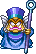
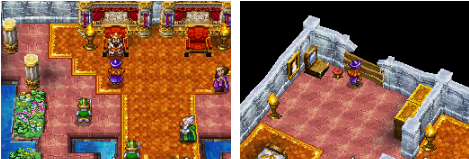

# Dragon Quest IV: Chapters of the Chosen

## 📖 Table of contents

1. [Main Story](#-main-story)
    - [Chapter 0: Prequel](#chapter-0-prequel)
    - [Chapter 1: Ragnar McRyan and the Case of the Missing Children](#chapter-1-Ragnar-McRyan-and-the-Case-of-the-Missing-Children)
    - [Chapter 2: Alena and the Journey to the Tourney](#chapter-2-Alena-and-the-Journey-to-the-Tourney)
    - [Chapter 3: Torneko and the Extravagant Excavation](#chapter-3-Torneko-and-the-Extravagant-Excavation)
    - [Chapter 4: The mystical world of Meena and Maya](#Chapter-4-The-mystical-world-of-Meena-and-Maya)
    - [Chapter 5: The Chosen](#Chapter-5-The-Chosen)
    - [Chapter EX: Post-Epilogue](#Chapter-EX-Post-Epilogue)
3. [Sides Quest]()
4. [Map](#map)
5. [Bestiary]()

# Main Story
## Chapter 0: Prequel
## Chapter 1: Ragnar McRyan and the Case of the Missing Children
In this first chapter, players are introduced to Ragnar McRyan, a knight of Burland. The King entrusts Ragnar with the mission of tracking down Psaro the Butcher, the thief of the Zenithian Sword. Ragnar, accompanied by his friend Cristo, sets off in search of justice. On their journey, they meet the vivacious Alena, a warrior princess who seeks to defy royal convention. The team gradually comes together and discovers that Psaro's motives run deeper than mere theft. They uncover royal plots and buried secrets, and prepare for the challenges ahead.

### Bastione Castle
You are now in command of a soldier of King Bastien: Ragnar McRyan, from the kingdom of Bastione. During a dialogue with the King, you learn that mothers have come to protest the disappearance of their children. After the dialogue with the King, one mother even comes to beg you to bring her son back. After that, head south out of the castle.

Continue southwards and you'll come across a market town. Talk to as many people as you can and get to know them. Once you've done that, head out of the town and you're back on the world map!

### Strattebourg Village
Head north-west and you will come to a cave. The monsters are more numerous, so don't be easily fooled by a shortage of life.
Cross the cave and find the exit to the north of it. This exit leads to the other side of the river, on the world map. Head west. You will discover a town: Strattebourg.

Inside, talk to as many people as you can. Then head north of the town to a secluded area, where you'll find a staircase in the ground.

Inside, you discover a cell inhabited by its prisoner. He tells you he is innocent and wants to get out. There's nothing you can do for him at the moment. However, get into the habit of breaking jars to find medicinal herbs. Leave the prison and go to the church to save yourself if you wish. Now you need to return to the original castle to announce your discoveries. Go back through the cave, killing a few monsters along the way to enhance your experience. Back in the castle town, go into a house to the west, go upstairs and find a man and a woman. The woman tells you that she knows the man in the cell! She asks you to take her to see him. So you have to go through the cave again... Return to Strattebourg by the route you should now know with your eyes closed.

Go straight to the prison. You're presented with a mini-scene in which the wife uses the puff-puff technique to knock some sense into her lucky husband. He tells you that there is a garden in the forest where strange things happen. So get out of Strattebourg and into the forest.

### Find the childrens
You eventually find the park. A path indicates the entrance to a well. Enter it. Inside, the path guides you to the right path, pointing you in the right direction.

Finally, you come across a chest containing the winged shoes. Explore the cave, taking care to avoid the many monsters. Stairs to the south-east lead you to a Healslime who can accompany you to heal you in battle if your health points are running low. Then exit the cave and use the winged shoes.

Here you are at the top of a tower, just west of the town of Strattebourg. You're witnessing a mini-scene between a child and an eye on legs. The dungeon isn't very big, so it's easy to make your way through the maze using the swivel view controls, which are very useful here.

Watch out for the much stronger monsters, though. Nevertheless, the presence of the medigluant should make your task much easier. On your way you come across two soldiers from the Empire. The second is in a bad way, and before the fatal moment, he tells you about a terrible enemy that can only be defeated by a chosen child. Continue on your way. You will come to a large room where you will find the eye on legs at the top of the tower. Talk to him and then to the child. You'll notice a figure to the north of the room, your first boss, so arm yourself heavily and set off with your life points at maximum. Talk to him to start the fight.

It's not a rocket scientist, but it's dangerous. Eliminate the eye first, leaving only the other. Use a combination of strikes and healing if necessary, and you'll get the better of it in no time.

## Boss 
### Pisaro's Hands

| No. | HP | MP | Attack | Defense | Agility | XP | Gold | Object |
|-----|----|----|--------|---------|---------|----|------|--------|
| 195 | 250| 0  |   52   |   36    |   16    | 73 | 60   | None   |

**Recommended Level and Team**: Ragnar, Doc (Level 9)

**Tips to Defeat the Boss**: 
Have the best possible equipment: the burning sword you find in the tower, iron armor, wooden helmet, iron shield (important, allows to reduce spell damage). Don’t forget to restore your HP/MP at the goddess statue before the boss, and put two or three herbs on Ragnar as a precaution.

Start by destroying the critter that accompanies him and focus on him. He can cast flame (quite high damage on one character), blow fire (rather weak damage on all) or physically attack (quite strong). Don’t trust your companion too much in case of a hard hit, it happens that he attacks or defends instead of healing… so if his hp or yours are low, don’t hesitate to use a herb. The boss should not resist too long anyway.

## Chapter 2: Alena and the Journey to the Tourney
The focus shifts to Torneko Taloon, an ordinary merchant with extraordinary aspirations. Torneko quits his job to pursue his dream of owning his own shop. Players follow his adventures through dangerous dungeons as he collects treasure and learns the tricks of the trade. Torneko becomes an endearing character, and his story shows that even heroes can have ordinary professions.

### Zamoksva Castle
You now control Princess Alina. Like all princesses who dream of adventure, she is being held back by her father, who is preventing her from travelling the world. He advises you to go and rest quietly in your room. Go down the small staircase in the corner of the throne room. Your room is the one on the north-east side of the floor. You will find a man repairing the wall that your character previously destroyed to escape. Leave the room and talk to as many people as you can throughout the castle, including all the floors.

During this visit, you meet one of your protectors, an old man called Borya, and a palace guard called Kiryl. After talking to everyone, you return to your room and find that the carpenter has finished his work and is no longer there. Walk over to him and you are asked if you want to force him. You watch as the princess smashes the floorboards. You can now leave. Outside, there's no point in going south except to see the imposing size of the castle, go north instead and fall down again, then go outside.

You are stopped by Kiryl and Borya, who join you in the team. Leave the castle and go to the first town you see on the world map

### Zalenagrad village
Talk to people to familiarise yourself with the place where the princess lives. Go to the shop to buy medicinal herbs and equipment, and to the church to save the day just in case.

Leave the town and forge your way through the mountains and forest. Then cross the mountains to the north-east, where you'll find a new town to enter.

### Taborov village
As usual, talk to everyone, especially the man in the big house on the right. You learn that his daughter is to be sacrificed to a monster. You suggest putting an end to these sacrifices, so the man advises you to go and see the man in charge of organising them: the priest, and head for the church.

The priest asks you to confirm what you want to do, and of course you do. You witness a short scene in which two men enter the church carrying a sacrificial altar. Your three adventurers enter, then the men move the altar to the place of sacrifice.

Night falls along with the darkness, when an evil character and two ghoulish dogs attack you. They're really not hard to kill. Start by killing the evil character in the middle, then all you have to do is kill the two dogs.

## BOSS
### Chameleon Humanoid

| No. | HP | MP | Attack | Defense | Agility | XP | Gold | Object |
|-----|----|----|--------|---------|---------|----|------|--------|
| 196 | 40| 6  |   28   |   28    |   50    | 136 | 60   | Life seed   |

**Recommended Level and Team**:  Alina, Kiryl, Borya (Level 4)

**Tips to Defeat the Boss**: 
Try to have at least one copper sword on Kiryl, a club on Alina and some protection (on Borya in particular). It's always a good idea to have a few herbs on Alina and Borya just in case.

Start by taking care of the two dogs with attacks and the Ice spell. Don't hesitate to keep Borya's hp high enough, as he doesn't take it very well! If you've learnt protection with Kiryl, don't hesitate to boost your most fragile characters, as this can make the fight easier. The boss attacks a single character or heals himself. Cast Alteration with Borya (once is enough) and attack until dead, as his HP is relatively low.
## After BOSS
Once you've won the battle, you rest and take control of your characters at the entrance to the town. Beside you is the man who told you to go and see the priest a few minutes ago. He thanks you for saving his daughter, and tells you that the item shop has reopened. Don't hesitate to go and have a look. After that, head north, back through the church, then the place of sacrifice, and you'll find yourself on the world map on the other side of the town. Keep heading north-east, killing as many monsters as you can along the way. You'll arrive in a new town: Vrenor.

### Vrenor village
Talk to everyone, then go to the inn, where you'll see a kidnapping on the first floor. Go after the robbers after the small scene, they flee to the west, follow them. The thieves have disappeared, but continue south.

You find a cave. Beware, the enemies are quite formidable, some attacking in groups of six or eight! Search the cavern, which isn't very big, from top to bottom, until you find the sparkling armband deep inside. Come out using a chimera wing or by going back the way you came. Return to Vrenor and find a child playing with a dog. He tells you that the thieves will only leave the false tsarina in exchange for the sparkling armband. Leave the town, but don't go too far from the world map, instead fighting monsters in the area until nightfall.

When night falls, return to the town and go to the cemetery to the north-west of the town. The exchange goes smoothly. You pick up the fake princess, Anya, who reveals that she's actually an actress. You then see her leave the town of Vrenor with her friends. You wake up in the morning at the inn in Vrenor, where the news of your rescue has sent the town's inhabitants into a frenzy! Leave the town and head for the cave you came across earlier, but don't go into it. Instead, turn south-west and you'll come to a desert, enter the village to the north.

### The Desert Bazaar
Talk to everyone, especially a guard near the pond. He tells you that your heroine's father is worried sick about you. Your mission now is to retrace the entire journey from the map to the castle at the beginning! Before leaving the desert village, don't hesitate to buy some weapons and armour!

### Return to Zamoksva Castle
Back at the castle, go and talk to the King. You can talk to him, but he can't, his voice is broken. The King's subordinate, the man next to him, tells you that the man living behind the castle might be able to help you. So go out through the princess's bedroom, drop down to the south, and go through the door opposite the wall you just fell on. The lone man inside tells you about the poet Joseph Staligne, who had the same problem as the king, but managed to recover his beautiful voice. This poet is in the town just west of the palace.

On the balcony to the right of the arms dealer, you can't miss him, he has a harp and blue hair. You can meet him by going inside the building. He tells you that he drank a potion of elven nectar called nightingale nectar to regain his voice. He also tells you that he found this potion at the bazaar in the desert. Leave the town and use a chimera wing to go to the desert bazaar. Go and talk to the old lady who runs this little shop at the very west of the bazaar, but only talk to her behind the counter, otherwise you'll start the usual shopping window. She'll tell you that the elven potion can only be found at the top of the tower to the west of the bazaar, so you know what you have to do.

### Nightingale's nectar Tower
Once you've reached the tower, you'll find an inn through the orange door. To climb the tower, you need the thief's key to open the blue door, with the man in front. The climb isn't rocket science, but try not to forget your chest on the way.

Once at the top, collect the nightingale nectar, then leave the tower. Use a chimera wing to heal the King. After a conversation that teaches you more about this mysterious evil character, the King lets you go.

### Chandor Castle
Use a new chimera wing to return to the desert bazaar, but don't go back there, go east instead. Go to the small temple by the sea. Inside, the guard will let you pass through to a blue portal, enter it and on the other side is an inn where you can rest. Leave the area and return to the world map, where you'll see that you've arrived in a new land. Head directly south-east, where you'll find a palace.

Talk to everyone in the town, and go to the castle to ask for the king (16). He informs you that he is organising a tournament, the winner of which must marry the princess. To take part in the tournament, leave the castle and enter from the left or the right. At the end of the hallway, speak to the guard on the left of the one behind the counter. You can also go to the right to find out what's waiting for you.

If you're feeling up to it and haven't forgotten to make a plan to buy new weapons and healing plants in the village, head left. You'll arrive in a large room with an inn, an item shop and a church. Be careful not to exit through the door at the back, otherwise you'll end up back on the world map and will have to walk all the way back to the arena vestibule. I recommend that you go and train the princess and buy the claw available in the item shop just before you enter the arena.

When you're ready, climb the central staircase. After a short speech from the King, you're off for Five Arena Fights. First you defeat Attila the Two, then Aubert the Sharp, Maggie Magic, Samson the Knight, and finally an Abominhomme des Neiges. The first four are not difficult, but watch out for the Snow Abominator who quadruples at the start of the fight. Don't panic, only one of the four will attack, the problem being to find the right one to hit each time, in other words, each turn you have a one-in-four chance of hitting the bull's-eye.

## BOSS
### Linguar

| No. | HP | MP | Attack | Defense | Agility | XP | Gold | Object |
|-----|----|----|--------|---------|---------|----|------|--------|
| 197 | 55 | 0  |   40   |   60    |   75    | 0 | 0   | None  |

**Recommended Level and Team**:  Alina (Level 12)

**Tips to Defeat the Boss**:
Make sure you have a claw, which you buy from the herbal merchant before you start, the best possible equipment and armour the rest of your inventory with herbs. You'll be facing 5 opponents. Don't forget that you can heal yourself between battles, so there's no need to end up with a full tank.

Attack and heal as necessary. The first opponent is some kind of monk, so you should be able to eat him up without even healing during the fight. The same goes for the next two (an archer and a sorceress). Make sure you're fully healed before engaging the next two, as they're a bit tougher. You'll probably need to use some herbs on the wandering armour, as it hits hard. The yeti is a bit annoying, creating doubles of himself. Keep your cool and strike until you get the right one, it's not dangerous if you've kept a few herbs in stock.
## After BOSS
After a scene, you see that your final opponent, Psaro the Exterminator, is nowhere to be found, so the King declares you the winner of the Chandor tournament. After a black screen and a final congratulations from the King, leave the palace and head for the village.

You are stopped by a guard dressed in orange, who advises you to hurry back to Zamoksva Castle before disappearing in the strangest of ways...

Go back to the castle where you started with a chimera wing. When you arrive, you notice a dead silence, the castle is empty and you're alone. All you have to do now is escape to your room and leave the castle to finish the chapter...

## Chapter 3: Torneko and the Extravagant Excavation
Twin sisters Meena and Maya seek revenge against Balzack, their father's murderer. Their quest takes them through mystical lands, populated by monsters and magical mysteries. Meena, a magician with psychic powers, and Maya, an agile dancer, form a formidable team. Together, they discover hidden truths about magic and the origins of their world.

### Lakanaba Village
You start this chapter at the command of a merchant called Torneko. As soon as you can move, get out of the house, talk to the old man and push him towards the church to get some gold coins! You've done your first good deed! After that, go to the weapon shop and talk to the man behind the counter to start your day's work, and for the first time in RPG history, you'll be able to move to the other side of the counter and make money by selling items, when normally it's always the other way round!

When you've had enough, go downstairs and speak to your boss again to stop your day's work. At the end of an exhausting day's work, go back to your house and talk to your wife, who will give you permission to take a well-deserved rest!

After that, leave the town and head north. There you'll find a cave, and inside you'll find a not-so-wizardly maze. The aim of the game is to push a large stone in such a way as to prevent the room from closing, and so gain access to the safe.

After that, leave the cave and head south until you find a castle.

### Ballimore Castle
Inside the castle, go and buy a chimera wing, then enter the castle to the north of the town. Go through the usual ritual: talk to everyone and familiarise yourself with your surroundings. Then go right past the throne room, walk around it along the north wall and take the stairs at the end. Here you are in the prison (5), watch out for the guards who will let you out if they see you.

Sneak past the guards on the right and talk to the man in the cell on the right. He says he knows you and begs you to give him a chimera wing. You can also use a chimera wing to return to your village at the beginning of the chapter.

### Animal's Village
In your village, head north-east and talk to the man you've just freed from prison. In gratitude, he'll lend you his dog! Leave the village, head south and enter the village in the middle of the forest. It's a village surrounded by trees, so you can't miss it. In this village, the young man's dog leaves you and goes into the house to the north, follow him.

Inside, talk to the man, who complains about losing his powers, and in a few moments, you're a fox! Following this, and thanks to the disappearance of the foxman's village, you find that the king's architect is returning to work. Without further ado, return the dog to its owner, then go and talk to the king, heading for the castle to the south! The king tells you that the bridge has now been repaired! Go to the bridge and cross it. On the other side, head south to the next castle.

### Chandor Castle
After talking to as many people as possible, go up to the throne room and speak to the king, who asks you if you've come to buy a trading establishment. Go to the prison and you'll learn that you need to be extremely wary of Psaro the Exterminator... When you leave the castle and go to the basement of the inn, you'll meet a good acquaintance in the casino you discovered so soon: Ragnar McRyan! On the 1st floor, however, you'll find Lauriel, an itinerant poet who can accompany you on your quest for five days for 600 gold coins!

Go back to Ballimore castle and talk to the prince, who asks you to come back to see him tonight. Go out of town, wait for nightfall and return to find the prince near the weapons shop (9). He will give you a letter. Return to Chandor Castle and give the letter to the princess. You'll learn that the Ballimore kingdom is going to try to invade Chandor.

The king will give you a royal scroll in which the King of Chandor suggests to the King of Ballimore that they marry their two children. You must now return to Chandor Castle in the south and give this scroll to the king. As a token of his thanks, the King will allow you to use your title deeds to open a shop!

### In search of treasure and money
In the inn, you learn a little more about a mysterious silver statuette with a man on the first floor, leave the town, cross the bridge just to the left and go north to find a cave, after the first one you find, enter it. Inside, go forward and take the raft, start to follow the water, after falling twice in waterfalls, dock, and go to the other end of the place find stairs. You'll come to a button, press it and the water will empty, allowing you to collect the various items in the chests. Go under a bridge and take the stairs down to the west. Take the boat, find the chests and moor where there are four statues arranged in a rectangle, and go up the stairs in the middle. At the end of the path is the famous silver statuette!

Go back to the room where you emptied the water, this time taking the stairs up. Go to the second castle, Chandor's, and sell your new statuette to a rich man in a house to the east, earning 25,000 gold coins. Now try to get 35,000 gold if you haven't already done so by selling items you've picked up from monsters or obtained from the chests in the previous cave. Once you've got the money, go into the empty shop and talk to the old man, who will sell you his shop for 35,000 gold coins. Now you're in front of your wife, talk to her again after the first dialogue to get some well-deserved rest!

After that, go to the throne room, where the King of Chandor will place his first order with you, asking for 6 iron swords and 6 pieces of iron armour. Fight monsters to get 6 iron swords and 6 iron armours, you can get help by hiring the services of a city soldier and the poet at the hotel, Lauriel. I advise you to go and fight the monsters in the cave where you found the silver statuette, as they drop these items fairly quickly. Once you have the items, return to King Chandor's castle and, on the ground floor, go and see the master-at-arms at the back next to the old man. Give him the weapons and, after checking, he'll give you 60,000 gold coins. If you've been talking to everyone as I've been advising you since the beginning of the adventure, you should have an idea of where you're going next.

### The tunnel
Go to the first cave to the east of Chandor Castle. Talk to the man inside, and just in time, to continue his work, he needs the 60,000 gold coins you've just won! Accept the offer and the work begins. Talk to the man with the 60,000 gold coins once more before returning to your wife in your new shop. She tells you that the casino has just opened! Go and lose a small fortune inside, before returning to your wife, who informs you that the tunnel is finished. She then asks you if you're going travelling, confirming by answering "yes". Go back to the tunnel, go through it, go up the stairs at the end, you've just finished the chapter.

## Chapter 4: The mystical world of Meena and Maya
The previous chapters converge on the Chosen Hero, a silent character that players can customise. The Hero brings together the characters from the previous chapters, forming a motley crew. They learn that Psaro the Butcher is not the true antagonist, but rather a person in search of redemption after the loss of his beloved. The team embarks on a journey to save the world, discovering key elements of the story and facing increasingly powerful adversaries.

## Chapter 5: The Chosen
Les héros découvrent l'existence d'un monde souterrain dirigé par Estark, une force maléfique. Ils doivent collecter des artefacts sacrés pour renforcer leur pouvoir et obtenir l'alliance des monstres opprimés par Estark. Ce chapitre met en avant des batailles épiques, des moments de sacrifice et des révélations sur l'histoire ancienne de leur monde. Les enjeux atteignent un sommet alors que l'équipe se prépare à affronter Estark.

## Chapter EX: Post-Epilogue
The final chapter sees the group take on Estark in an epic battle to save the world. Psaro the Butcher realises the true meaning of love and sacrifice, bringing an emotional dimension to the story. After intense battles, moments of reflection and difficult choices, peace is finally restored to the world. The heroes return to their daily lives, forever scarred by the trials they have overcome.

## Map

