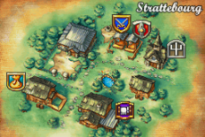
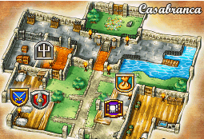
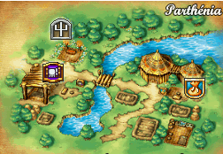
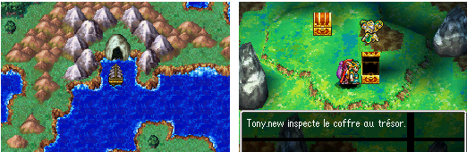

# Dragon Quest IV: Chapters of the Chosen

## 📖 Table of contents

1. [Main Story](#-main-story)
    - [Chapter 0: Prequel](#chapter-0-prequel)
    - [Chapter 1: Ragnar McRyan and the Case of the Missing Children](#chapter-1-Ragnar-McRyan-and-the-Case-of-the-Missing-Children)
    - [Chapter 2: Alena and the Journey to the Tourney](#chapter-2-Alena-and-the-Journey-to-the-Tourney)
    - [Chapter 3: Torneko and the Extravagant Excavation](#chapter-3-Torneko-and-the-Extravagant-Excavation)
    - [Chapter 4: The mystical world of Meena and Maya](#Chapter-4-The-mystical-world-of-Meena-and-Maya)
    - [Chapter 5: The Chosen](#Chapter-5-The-Chosen)
    - [Chapter EX: Post-Epilogue](#Chapter-EX-Post-Epilogue)
2. [Sides Quests](#Sides-Quests)
    - [The cursed equipment](#The-cursed-equipment)
    - [Hoffman Junior's migrant city](#Hoffman-Junior-s-migrant-city)
    - [Casino](#Casino)
    - [Mini-Medals](MiniMedals.md)
3. [Map](#map)
4. [Bestiary](#Bestiary)

# Main Story
## Chapter 0: Prequel
On going

## Chapter 1: Ragnar McRyan and the Case of the Missing Children
In this first chapter, players are introduced to Ragnar McRyan, a knight of Burland. The King entrusts Ragnar with the mission of tracking down Psaro the Butcher, the thief of the Zenithian Sword. Ragnar, accompanied by his friend Cristo, sets off in search of justice. On their journey, they meet the vivacious Alena, a warrior princess who seeks to defy royal convention. The team gradually comes together and discovers that Psaro's motives run deeper than mere theft. They uncover royal plots and buried secrets, and prepare for the challenges ahead.

### Bastione Castle
You are now in command of a soldier of King Bastien: Ragnar McRyan, from the kingdom of Bastione. During a dialogue with the King, you learn that mothers have come to protest the disappearance of their children. After the dialogue with the King, one mother even comes to beg you to bring her son back. After that, head south out of the castle.

Continue southwards and you'll come across a market town. Talk to as many people as you can and get to know them. Once you've done that, head out of the town and you're back on the world map!

### Strattebourg Village
Head north-west and you will come to a cave. The monsters are more numerous, so don't be easily fooled by a shortage of life.
Cross the cave and find the exit to the north of it. This exit leads to the other side of the river, on the world map. Head west. You will discover a town: Strattebourg.

Inside, talk to as many people as you can. Then head north of the town to a secluded area, where you'll find a staircase in the ground.

Inside, you discover a cell inhabited by its prisoner. He tells you he is innocent and wants to get out. There's nothing you can do for him at the moment. However, get into the habit of breaking jars to find medicinal herbs. Leave the prison and go to the church to save yourself if you wish. Now you need to return to the original castle to announce your discoveries. Go back through the cave, killing a few monsters along the way to enhance your experience. Back in the castle town, go into a house to the west, go upstairs and find a man and a woman. The woman tells you that she knows the man in the cell! She asks you to take her to see him. So you have to go through the cave again... Return to Strattebourg by the route you should now know with your eyes closed.

Go straight to the prison. You're presented with a mini-scene in which the wife uses the puff-puff technique to knock some sense into her lucky husband. He tells you that there is a garden in the forest where strange things happen. So get out of Strattebourg and into the forest.

### Find the childrens
You eventually find the park. A path indicates the entrance to a well. Enter it. Inside, the path guides you to the right path, pointing you in the right direction.

Finally, you come across a chest containing the winged shoes. Explore the cave, taking care to avoid the many monsters. Stairs to the south-east lead you to a Healslime who can accompany you to heal you in battle if your health points are running low. Then exit the cave and use the winged shoes.

Here you are at the top of a tower, just west of the town of Strattebourg. You're witnessing a mini-scene between a child and an eye on legs. The dungeon isn't very big, so it's easy to make your way through the maze using the swivel view controls, which are very useful here.

Watch out for the much stronger monsters, though. Nevertheless, the presence of the medigluant should make your task much easier. On your way you come across two soldiers from the Empire. The second is in a bad way, and before the fatal moment, he tells you about a terrible enemy that can only be defeated by a chosen child. Continue on your way. You will come to a large room where you will find the eye on legs at the top of the tower. Talk to him and then to the child. You'll notice a figure to the north of the room, your first boss, so arm yourself heavily and set off with your life points at maximum. Talk to him to start the fight.

It's not a rocket scientist, but it's dangerous. Eliminate the eye first, leaving only the other. Use a combination of strikes and healing if necessary, and you'll get the better of it in no time.

## Boss 
### Pisaro's Hands

| No. | HP | MP | Attack | Defense | Agility | XP | Gold | Object |
|-----|----|----|--------|---------|---------|----|------|--------|
| 195 | 250| 0  |   52   |   36    |   16    | 73 | 60   | None   |

**Recommended Level and Team**: Ragnar, Doc (Level 9)

**Tips to Defeat the Boss**: 
Have the best possible equipment: the burning sword you find in the tower, iron armor, wooden helmet, iron shield (important, allows to reduce spell damage). Don’t forget to restore your HP/MP at the goddess statue before the boss, and put two or three herbs on Ragnar as a precaution.

Start by destroying the critter that accompanies him and focus on him. He can cast flame (quite high damage on one character), blow fire (rather weak damage on all) or physically attack (quite strong). Don’t trust your companion too much in case of a hard hit, it happens that he attacks or defends instead of healing… so if his hp or yours are low, don’t hesitate to use a herb. The boss should not resist too long anyway.

## Chapter 2: Alena and the Journey to the Tourney
The focus shifts to Torneko Taloon, an ordinary merchant with extraordinary aspirations. Torneko quits his job to pursue his dream of owning his own shop. Players follow his adventures through dangerous dungeons as he collects treasure and learns the tricks of the trade. Torneko becomes an endearing character, and his story shows that even heroes can have ordinary professions.

### Zamoksva Castle
You now control Princess Alina. Like all princesses who dream of adventure, she is being held back by her father, who is preventing her from travelling the world. He advises you to go and rest quietly in your room. Go down the small staircase in the corner of the throne room. Your room is the one on the north-east side of the floor. You will find a man repairing the wall that your character previously destroyed to escape. Leave the room and talk to as many people as you can throughout the castle, including all the floors.

During this visit, you meet one of your protectors, an old man called Borya, and a palace guard called Kiryl. After talking to everyone, you return to your room and find that the carpenter has finished his work and is no longer there. Walk over to him and you are asked if you want to force him. You watch as the princess smashes the floorboards. You can now leave. Outside, there's no point in going south except to see the imposing size of the castle, go north instead and fall down again, then go outside.

You are stopped by Kiryl and Borya, who join you in the team. Leave the castle and go to the first town you see on the world map

### Zalenagrad village
Talk to people to familiarise yourself with the place where the princess lives. Go to the shop to buy medicinal herbs and equipment, and to the church to save the day just in case.

Leave the town and forge your way through the mountains and forest. Then cross the mountains to the north-east, where you'll find a new town to enter.

### Taborov village
As usual, talk to everyone, especially the man in the big house on the right. You learn that his daughter is to be sacrificed to a monster. You suggest putting an end to these sacrifices, so the man advises you to go and see the man in charge of organising them: the priest, and head for the church.

The priest asks you to confirm what you want to do, and of course you do. You witness a short scene in which two men enter the church carrying a sacrificial altar. Your three adventurers enter, then the men move the altar to the place of sacrifice.

Night falls along with the darkness, when an evil character and two ghoulish dogs attack you. They're really not hard to kill. Start by killing the evil character in the middle, then all you have to do is kill the two dogs.

## BOSS
### Chameleon Humanoid

| No. | HP | MP | Attack | Defense | Agility | XP | Gold | Object |
|-----|----|----|--------|---------|---------|----|------|--------|
| 196 | 40| 6  |   28   |   28    |   50    | 136 | 60   | Life seed   |

**Recommended Level and Team**:  Alina, Kiryl, Borya (Level 4)

**Tips to Defeat the Boss**: 
Try to have at least one copper sword on Kiryl, a club on Alina and some protection (on Borya in particular). It's always a good idea to have a few herbs on Alina and Borya just in case.

Start by taking care of the two dogs with attacks and the Ice spell. Don't hesitate to keep Borya's hp high enough, as he doesn't take it very well! If you've learnt protection with Kiryl, don't hesitate to boost your most fragile characters, as this can make the fight easier. The boss attacks a single character or heals himself. Cast Alteration with Borya (once is enough) and attack until dead, as his HP is relatively low.
## After BOSS
Once you've won the battle, you rest and take control of your characters at the entrance to the town. Beside you is the man who told you to go and see the priest a few minutes ago. He thanks you for saving his daughter, and tells you that the item shop has reopened. Don't hesitate to go and have a look. After that, head north, back through the church, then the place of sacrifice, and you'll find yourself on the world map on the other side of the town. Keep heading north-east, killing as many monsters as you can along the way. You'll arrive in a new town: Vrenor.

### Vrenor village
Talk to everyone, then go to the inn, where you'll see a kidnapping on the first floor. Go after the robbers after the small scene, they flee to the west, follow them. The thieves have disappeared, but continue south.

You find a cave. Beware, the enemies are quite formidable, some attacking in groups of six or eight! Search the cavern, which isn't very big, from top to bottom, until you find the sparkling armband deep inside. Come out using a chimera wing or by going back the way you came. Return to Vrenor and find a child playing with a dog. He tells you that the thieves will only leave the false tsarina in exchange for the sparkling armband. Leave the town, but don't go too far from the world map, instead fighting monsters in the area until nightfall.

When night falls, return to the town and go to the cemetery to the north-west of the town. The exchange goes smoothly. You pick up the fake princess, Anya, who reveals that she's actually an actress. You then see her leave the town of Vrenor with her friends. You wake up in the morning at the inn in Vrenor, where the news of your rescue has sent the town's inhabitants into a frenzy! Leave the town and head for the cave you came across earlier, but don't go into it. Instead, turn south-west and you'll come to a desert, enter the village to the north.

### The Desert Bazaar
Talk to everyone, especially a guard near the pond. He tells you that your heroine's father is worried sick about you. Your mission now is to retrace the entire journey from the map to the castle at the beginning! Before leaving the desert village, don't hesitate to buy some weapons and armour!

### Return to Zamoksva Castle
Back at the castle, go and talk to the King. You can talk to him, but he can't, his voice is broken. The King's subordinate, the man next to him, tells you that the man living behind the castle might be able to help you. So go out through the princess's bedroom, drop down to the south, and go through the door opposite the wall you just fell on. The lone man inside tells you about the poet Joseph Staligne, who had the same problem as the king, but managed to recover his beautiful voice. This poet is in the town just west of the palace.

On the balcony to the right of the arms dealer, you can't miss him, he has a harp and blue hair. You can meet him by going inside the building. He tells you that he drank a potion of elven nectar called nightingale nectar to regain his voice. He also tells you that he found this potion at the bazaar in the desert. Leave the town and use a chimera wing to go to the desert bazaar. Go and talk to the old lady who runs this little shop at the very west of the bazaar, but only talk to her behind the counter, otherwise you'll start the usual shopping window. She'll tell you that the elven potion can only be found at the top of the tower to the west of the bazaar, so you know what you have to do.

### Nightingale's nectar Tower
Once you've reached the tower, you'll find an inn through the orange door. To climb the tower, you need the thief's key to open the blue door, with the man in front. The climb isn't rocket science, but try not to forget your chest on the way.

Once at the top, collect the nightingale nectar, then leave the tower. Use a chimera wing to heal the King. After a conversation that teaches you more about this mysterious evil character, the King lets you go.

### Chandor Castle
Use a new chimera wing to return to the desert bazaar, but don't go back there, go east instead. Go to the small temple by the sea. Inside, the guard will let you pass through to a blue portal, enter it and on the other side is an inn where you can rest. Leave the area and return to the world map, where you'll see that you've arrived in a new land. Head directly south-east, where you'll find a palace.

Talk to everyone in the town, and go to the castle to ask for the king (16). He informs you that he is organising a tournament, the winner of which must marry the princess. To take part in the tournament, leave the castle and enter from the left or the right. At the end of the hallway, speak to the guard on the left of the one behind the counter. You can also go to the right to find out what's waiting for you.

If you're feeling up to it and haven't forgotten to make a plan to buy new weapons and healing plants in the village, head left. You'll arrive in a large room with an inn, an item shop and a church. Be careful not to exit through the door at the back, otherwise you'll end up back on the world map and will have to walk all the way back to the arena vestibule. I recommend that you go and train the princess and buy the claw available in the item shop just before you enter the arena.

When you're ready, climb the central staircase. After a short speech from the King, you're off for Five Arena Fights. First you defeat Attila the Two, then Aubert the Sharp, Maggie Magic, Samson the Knight, and finally an Abominhomme des Neiges. The first four are not difficult, but watch out for the Snow Abominator who quadruples at the start of the fight. Don't panic, only one of the four will attack, the problem being to find the right one to hit each time, in other words, each turn you have a one-in-four chance of hitting the bull's-eye.

## BOSS
### Linguar

| No. | HP | MP | Attack | Defense | Agility | XP | Gold | Object |
|-----|----|----|--------|---------|---------|----|------|--------|
| 197 | 55 | 0  |   40   |   60    |   75    | 0 | 0   | None  |

**Recommended Level and Team**:  Alina (Level 12)

**Tips to Defeat the Boss**:
Make sure you have a claw, which you buy from the herbal merchant before you start, the best possible equipment and armour the rest of your inventory with herbs. You'll be facing 5 opponents. Don't forget that you can heal yourself between battles, so there's no need to end up with a full tank.

Attack and heal as necessary. The first opponent is some kind of monk, so you should be able to eat him up without even healing during the fight. The same goes for the next two (an archer and a sorceress). Make sure you're fully healed before engaging the next two, as they're a bit tougher. You'll probably need to use some herbs on the wandering armour, as it hits hard. The yeti is a bit annoying, creating doubles of himself. Keep your cool and strike until you get the right one, it's not dangerous if you've kept a few herbs in stock.
## After BOSS
After a scene, you see that your final opponent, Psaro the Exterminator, is nowhere to be found, so the King declares you the winner of the Chandor tournament. After a black screen and a final congratulations from the King, leave the palace and head for the village.

You are stopped by a guard dressed in orange, who advises you to hurry back to Zamoksva Castle before disappearing in the strangest of ways...

Go back to the castle where you started with a chimera wing. When you arrive, you notice a dead silence, the castle is empty and you're alone. All you have to do now is escape to your room and leave the castle to finish the chapter...

## Chapter 3: Torneko and the Extravagant Excavation
Twin sisters Meena and Maya seek revenge against Balzack, their father's murderer. Their quest takes them through mystical lands, populated by monsters and magical mysteries. Meena, a magician with psychic powers, and Maya, an agile dancer, form a formidable team. Together, they discover hidden truths about magic and the origins of their world.

### Lakanaba Village
You start this chapter at the command of a merchant called Torneko. As soon as you can move, get out of the house, talk to the old man and push him towards the church to get some gold coins! You've done your first good deed! After that, go to the weapon shop and talk to the man behind the counter to start your day's work, and for the first time in RPG history, you'll be able to move to the other side of the counter and make money by selling items, when normally it's always the other way round!

When you've had enough, go downstairs and speak to your boss again to stop your day's work. At the end of an exhausting day's work, go back to your house and talk to your wife, who will give you permission to take a well-deserved rest!

After that, leave the town and head north. There you'll find a cave, and inside you'll find a not-so-wizardly maze. The aim of the game is to push a large stone in such a way as to prevent the room from closing, and so gain access to the safe.

After that, leave the cave and head south until you find a castle.

### Ballimore Castle
Inside the castle, go and buy a chimera wing, then enter the castle to the north of the town. Go through the usual ritual: talk to everyone and familiarise yourself with your surroundings. Then go right past the throne room, walk around it along the north wall and take the stairs at the end. Here you are in the prison (5), watch out for the guards who will let you out if they see you.

Sneak past the guards on the right and talk to the man in the cell on the right. He says he knows you and begs you to give him a chimera wing. You can also use a chimera wing to return to your village at the beginning of the chapter.

### Animal's Village
In your village, head north-east and talk to the man you've just freed from prison. In gratitude, he'll lend you his dog! Leave the village, head south and enter the village in the middle of the forest. It's a village surrounded by trees, so you can't miss it. In this village, the young man's dog leaves you and goes into the house to the north, follow him.

Inside, talk to the man, who complains about losing his powers, and in a few moments, you're a fox! Following this, and thanks to the disappearance of the foxman's village, you find that the king's architect is returning to work. Without further ado, return the dog to its owner, then go and talk to the king, heading for the castle to the south! The king tells you that the bridge has now been repaired! Go to the bridge and cross it. On the other side, head south to the next castle.

### Chandor Castle
After talking to as many people as possible, go up to the throne room and speak to the king, who asks you if you've come to buy a trading establishment. Go to the prison and you'll learn that you need to be extremely wary of Psaro the Exterminator... When you leave the castle and go to the basement of the inn, you'll meet a good acquaintance in the casino you discovered so soon: Ragnar McRyan! On the 1st floor, however, you'll find Lauriel, an itinerant poet who can accompany you on your quest for five days for 600 gold coins!

Go back to Ballimore castle and talk to the prince, who asks you to come back to see him tonight. Go out of town, wait for nightfall and return to find the prince near the weapons shop (9). He will give you a letter. Return to Chandor Castle and give the letter to the princess. You'll learn that the Ballimore kingdom is going to try to invade Chandor.

The king will give you a royal scroll in which the King of Chandor suggests to the King of Ballimore that they marry their two children. You must now return to Chandor Castle in the south and give this scroll to the king. As a token of his thanks, the King will allow you to use your title deeds to open a shop!

### In search of treasure and money
In the inn, you learn a little more about a mysterious silver statuette with a man on the first floor, leave the town, cross the bridge just to the left and go north to find a cave, after the first one you find, enter it. Inside, go forward and take the raft, start to follow the water, after falling twice in waterfalls, dock, and go to the other end of the place find stairs. You'll come to a button, press it and the water will empty, allowing you to collect the various items in the chests. Go under a bridge and take the stairs down to the west. Take the boat, find the chests and moor where there are four statues arranged in a rectangle, and go up the stairs in the middle. At the end of the path is the famous silver statuette!

Go back to the room where you emptied the water, this time taking the stairs up. Go to the second castle, Chandor's, and sell your new statuette to a rich man in a house to the east, earning 25,000 gold coins. Now try to get 35,000 gold if you haven't already done so by selling items you've picked up from monsters or obtained from the chests in the previous cave. Once you've got the money, go into the empty shop and talk to the old man, who will sell you his shop for 35,000 gold coins. Now you're in front of your wife, talk to her again after the first dialogue to get some well-deserved rest!

After that, go to the throne room, where the King of Chandor will place his first order with you, asking for 6 iron swords and 6 pieces of iron armour. Fight monsters to get 6 iron swords and 6 iron armours, you can get help by hiring the services of a city soldier and the poet at the hotel, Lauriel. I advise you to go and fight the monsters in the cave where you found the silver statuette, as they drop these items fairly quickly. Once you have the items, return to King Chandor's castle and, on the ground floor, go and see the master-at-arms at the back next to the old man. Give him the weapons and, after checking, he'll give you 60,000 gold coins. If you've been talking to everyone as I've been advising you since the beginning of the adventure, you should have an idea of where you're going next.

### The tunnel
Go to the first cave to the east of Chandor Castle. Talk to the man inside, and just in time, to continue his work, he needs the 60,000 gold coins you've just won! Accept the offer and the work begins. Talk to the man with the 60,000 gold coins once more before returning to your wife in your new shop. She tells you that the casino has just opened! Go and lose a small fortune inside, before returning to your wife, who informs you that the tunnel is finished. She then asks you if you're going travelling, confirming by answering "yes". Go back to the tunnel, go through it, go up the stairs at the end, you've just finished the chapter.

## Chapter 4: The mystical world of Meena and Maya
The previous chapters converge on the Chosen Hero, a silent character that players can customise. The Hero brings together the characters from the previous chapters, forming a motley crew. They learn that Psaro the Butcher is not the true antagonist, but rather a person in search of redemption after the loss of his beloved. The team embarks on a journey to save the world, discovering key elements of the story and facing increasingly powerful adversaries.

### Teafortwo Town
Here you are, live from a dance show! After admiring Maya's dance, you realise that she and her sister Mina have had to leave, after accepting a pittance of 100 gold coins.

It's time to leave the town and head straight for the first village to the north.

### Deadend Village
Talk to everyone, you notice a dog barking at you, on the other side of the house which it seems to be guarding valiantly, is a seed of life at the foot of a grave, leave this town, cross the two bridges to the west, and enter the cave.

Inside is a chest and at the end of the long corridor is a lift. Follow the corridor, the chest and the lift down until you find the Sphere of Silence, following a south-facing path. Go back up twice, this time heading north.

After descending another lift, you come face to face with Oojam. He learns of your desire to avenge your father, which is why he wants to join you, and you also learn a little more about the famous Dickenz... Open the chest beside him to get the ***Lamp of Darkness***. Finally, leave the cave. Leave the cave the other way round.

### The town of Port Lionel
Return to the village of Deadend, and from its position on the world map, head north-east until you find the town of Port Lionel, passing through a castle without entering it. It's essential to stop off in this town to stock up on life and equipment and to save.

Once you're heavily equipped, leave the village and head due west. Continue westwards until you pass a sort of grey altar on the world map, at which point you should head due north-west.

### The Albion mines
Once you've found the village and gone inside, you'll see a mine to the north. Inside, immediately to your right, you'll find a magic seed in a pot, next to a man. Make your way upwards and at one point you will come to a fork in the road: to the right is a chest with silver cards to be collected, and to the right is a staircase. After descending the stairs, a seed of magic awaits you in front of the gravestones on the right. To the left is a dead end, so head upwards.

Make your way up another set of stairs. Next, there's a chest containing a jar of gunpowder for you to pick up. When the two men don't tell you anything interesting, leave the cave. Return to the castle you passed earlier, and go through the door at the entrance on the right, which mysteriously opens thanks to the presence of Oojam...

### Lord Lionel's palace
Use the powder behind the wall where the Chancellor is, in the corridor just next to the room at the bottom right, as soon as you arrive on the floor. He will then head for a secret room, so I advise you to follow him discreetly, without letting him see you. Look carefully at the section of wall that opens and closes, and press A on this section to enter.

You discover the room where Lord Regent is hiding. Within the first few seconds of combat, you notice that you are finally facing the famous Dickenz! To defeat him easily, use the sphere of silence to prevent him from using his spells. Otherwise, I'd advise you to have a good fighting level, as this is not an easy boss to beat!

## BOSS
### Balzack

| No. | HP | MP | Attack | Defense | Agility | XP | Gold | Object |
|-----|----|----|--------|---------|---------|----|------|--------|
| 198 | 300 | 0  |   72   |   36    |   22    | 500 | 0   | None  |

**Recommended Level and Team**: Oojam, Mina, Maya (level 11)

**Tips to Defeat the Boss**:
Important: place the sphere of silence on Maya. Allow yourself the luxury of having all the best weapons/armour available in the port. Put some herbs on Maya.

This boss is largely playable with a level of 10, but if you're unlucky he can kill you in the end. As far as I know, he can cast Crame, breathe fire or attack, which is even more dangerous as he hits hard, so keep your HP high enough even if you have to heal in quick succession with Mina. Start attacking him on the first turn with Mina and use the sphere of silence with Maya, and presto! he's deprived of his spells. Be careful to use it again when a message tells you that the effect is dissipating, otherwise he'll cast Crame and that will cause a lot of damage to everyone... Lower his defence with Alteration and heal/attack (fire spells work on him).

## After BOSS
Once you've won, you'll notice the appearance of Lord Lionel.

As the boss you've just beaten begs him not to tell Psaro about his defeat, the battle begins against Lord Lionel! Don't worry: this boss is unbeatable, and the only way to continue the adventure is to lose. After this impromptu defeat, you find that you've been thrown into prison with an old man. You don't need perfect eyesight to see a passage behind the jars and barrels that surround you, and I advise you to take it if you don't want to turn into dragon dung... Following the passage, a chest containing a permit to board must be opened before continuing.

On your way out, you realise that you've found your bearings, but fortunately your friend distracts you so that you can leave the castle to the south. You must now return to the port city, heading due north on the world map. In the village, head north-west. Enter the harbour and ask the sailor to let you pass, after examining your recently collected permits. Go and talk to the captain, then to the passengers, and finally to the captain, who asks you to confirm your voyage, confirm... You've just completed this chapter.

## Chapter 5: The Chosen
Les héros découvrent l'existence d'un monde souterrain dirigé par Estark, une force maléfique. Ils doivent collecter des artefacts sacrés pour renforcer leur pouvoir et obtenir l'alliance des monstres opprimés par Estark. Ce chapitre met en avant des batailles épiques, des moments de sacrifice et des révélations sur l'histoire ancienne de leur monde. Les enjeux atteignent un sommet alors que l'équipe se prépare à affronter Estark.

### The hero's odyssey begins
Here you are in control of Solo, the hero you were only able to use at the start of the game. You notice that your mother has asked you to take a packed lunch to your father, who is fishing near the lake. So leave the house and do what you always do: talk to as many people as you can. Your father is in the north of the village, near the lake, to the left of the bridge. After the small talk that follows, return to the starting point and talk to your mother.

She asks if you'd like to eat, and as I assume you'll be starving, you accept. You see your hero sitting down, when suddenly... a man intervenes, the music cuts out and you are told that the village has been found by monsters!

You are then told that you absolutely must hide. As you flee through the village, you realise that you seem much more important than you think... After hiding in a small room, a (woman/man) joins you and transforms into you! Once you've regained control of your character, you notice a terrible disaster: the water is poisonous and the houses are ashes and flames... Now all you have to do is leave this sinister landscape.

### Casabranca Castle
Head south to find a small house, at the foot of which is a seed of life. Inside the house is a suit of copper armour that you should equip as soon as possible.

To the south-east of this house is the castle of Casabranca. Talk to everyone, then go and see the King, who simply tells you that your mission is to prevent the Lord of the Underworld from waking up! Leave the castle and head south-west towards a cave.

### Chandor Castle
You recognise this cave because you had it built by paying 60,000 gold coins with Torneko's help. On your way out, fight a few monsters to get your hands on a few well earned levels. Cross the tunnel you've just passed several times, to receive confetti on your head, and learn that you're the thousandth person to have passed through this tunnel! You will receive 100 playable chips at the Chandor casino! Now go to Chandor.

To the west of the village lies Mina! Let her read your handwriting and she'll realise that you're the legendary hero! So she decides to join you. Pick up Maya at the casino. You can then go to the Coliseum to attend the wedding of the prince and princess.

### The grotto of the symbol of faith
Go back to Casabranca, and from there, on the world map, head due east for a long time, cross some bridges and come to a cave. Inside, you'll witness several confrontations with clones of the sisters Maya and Mina.

## BOSS
### Tricksyurchin

| No. | HP | MP | Attack | Defense | Agility | XP | Gold | Object |
|-----|----|----|--------|---------|---------|----|------|--------|
| 199 | 35 | 0  |   37   |   30    |   3    | 450 | 20   | None  |

**Recommended Level and Team**: Héros (Niveau 6)

**Tips to Defeat the Boss**:
Before entering this dungeon, you'll need some decent armour and possibly a weapon more effective than your copper sword... you can buy a steel sword in Ballimore (north of Chandor), for example. Don't do things by halves, buy a Falcon blade from the casino, for example.

Nothing complicated, except that you'd better take care of the two bats first, as they're fragile and can put you to sleep, which could annoy you.

## After BOSS
Once defeated, go back up the stairs.

When you find the real ones, Maya asks you if it was Mina who was spending all her money at the casino. To prove your identity, answer no. Continue into the cave until you reach a room with a central square and walls to crumble around. To enter the room, just push down the walls until you reach the back of the central square, and then enter from the back. Open the chest inside and you'll get the ***symbol of Faith!*** Now leave the cave.

### The Hank Hoffman Junior Inn
Cross the three bridges again, and go to the little place at the edge of the desert, which you passed on the way to the cave. Go into the inn and speak to Hank Hoffman Junior. By making him look at the symbol of faith, you learn that Hoffman has let himself be fooled by his friend's double, which is how they betrayed each other. To avenge this shameful act, the man decides to join your team! This is how you enter the desert. Head south/south-east.

### Town of Bourg-les-Bains 
After walking for a while, enter the spa town of évaux... de bourg-les-bains!

Fill up on life, equipment and save! Leave the city after gathering as much information as possible, and head due south.

### The tower of sacred embers
Along the way, you'll come across the town of Port-Carène. There's no need to enter it, unless you want to do some shopping. From here, head due east, crossing a bridge a little to the north, and you'll come to a yellow tower. Step inside, and what a pleasant surprise! You meet Torneko!

He entrusts you with the mission of destroying the evil flame at the top of the tower, and recovering embers from the ancient luminous flame. Climbing the tower isn't complicated... You'll come across a number of chests to open, watch out for the hole, pass a mini-demon that knocks itself out... and reach the top, where you'll find the sacred embers in a chest!

Then take the stairs to the north-east. Go around them, and fight the monsters after you've seen the black flame. Be careful, these monsters are difficult to defeat - a very good level is recommended! Take care of the two on the sides first, before tackling the central one. Chain healing spells with the sisters while the hero and Hoffman type.

## BOSS
### Lighthousebengal

| No. | HP | MP | Attack | Defense | Agility | XP | Gold | Object |
|-----|----|----|--------|---------|---------|----|------|--------|
| 200 | 230 | 9  |   78   |   73    |   20    | 2000 | 350   | None  |

**Recommended Level and Team**: Hero, Maya et Mina (Level 17)

**Tips to Defeat the Boss**
Destroy the two Tizou as quickly as possible. Use Mina's spells to heal yourself, such as First Aid and Partial Healing. Attack with Maya using Supercrame on Tigroar. Devote your hero to physical attacks.

## After BOSS
Once you've won the battle, get as close as you can to the black flames, and use the sacred embers! Once you've passed this little scene, simply head due south to jump off the tower and leave it!

### Port-Carène Town
Return to Port-Carène, rest and buy new equipment. Once this is done, head for the port's outer docks.

You find Torneko again. Talk to him, and he'll ask for your permission to accompany you - accept! Congratulations, Torneko is now part of your team!

### Ringys Town
At last, you've got an efficient way to brave the seas! Head due south, and dock at the first land you see. Head a little to the east, and you'll find the first village: Ringys. You're immediately surprised by Hoffman, who tells you he recognizes the place and wishes to leave your group. Accept, but he leaves you Marylou, his horse.

Go to Conrad Ilton (no relation to the Paris family), answer no to his question. Then accept his test. You receive the treasure map! Now go to the inn on the second floor. Talk to Borya, who asks you to go and help Tsarina Alina, an old acquaintance of yours! And so Borya accompanies you! Leave the city.

### Parthénia Town
Go east, then southeast, to find a castle, which is actually just a village when you enter it. Stock up on weapons and life, and save. There's nothing more interesting to do here at the moment. Now head south-east.

You find a cave, enter it. Inside, you notice Alina smashing a locked door! As you follow the small group, you notice a role-playing classic: the arrow slabs! Move on to the next staircase, and climb it. On the bottom floor, talk to Alina, who's determined to get her hands on those camomile seeds. Work your way through the arrow plates until you find a new staircase to climb! Continue through the maze of arrows until you finally reach the chest containing the ***chamomile seeds***... A word of advice if you don't make it to the chest: before launching yourself into the arrows, keep an eye on where they lead!

Once you have the seeds, leave the area and return to the village of Parthenia. Talk to Emperor Claudius in the fields. Sow the chamomile seeds, and watch them grow very quickly! Emperor Claudius hands you a chamomile root. Go back to Ringys, and return to the second floor of the inn, open the door to Alina's room, and after a speech, use the chamomile root on Kiryl. Kiryl and Alina join you!

### The magic key cave
Cross the ocean due west, and return to the cave at the start of chapter 4. It was in this cave that you found the Lamp of Darkness; return to the chest where you discovered it, and press it again, even if it's empty.

You are asked to activate a mechanism, accept. Steps appear, take them. Inside, break the jars, open the doors, then the chest, and you've got the magic key! Leave the cave.

### To Lord Lionel's palace
Head east, recrossing the town, and from there head due north until you find Lord Lionel's castle fairly quickly. Go inside, and find Ragnar McRyan. He seems delighted to find you at last! Follow him to the hiding place you probably already know!

While Ragnar takes care of the guards, talk to Lord Lionel and the battle begins! Be careful, this is probably the most difficult enemy you've faced so far! I therefore recommend a good level, and a good strategy! The hero strikes while the other character heals.

## BOSS
### Keeleon

| No. | HP | MP | Attack | Defense | Agility | XP | Gold | Object |
|-----|----|----|--------|---------|---------|----|------|--------|
| 201 | 950 |  9  |  123  |  80  |    18    | 5100 |  0  | Plate Armor |

**Recommended Level and Team**: Hero, Alina, Kiryl, Mina (Niveau 17)

**Tips to Defeat the Boss**
You're about to take on one of the toughest bosses in the game, so a little preparation goes a long way. You'll probably spend a little time leveling up, but nothing's impossible. Fight a little in the Port Lionel area rather than against metal slime: you may gain less experience, but you'll have a well-stocked purse.

Try to get the best equipment on your fighting team: by the way, there are good sellers at Deadend Inn, Zamoksva (accessible with the magic key) and Chandor's secret store. Put some herbs on Alina and spread some items among your characters to recover your MP, you might need them.

You can start picking up bits of Zenithian armor before this boss: helmet and armor in particular... which makes combat easier, but alters the "natural" order of the game, so I don't recommend it.

This dreadful creature acts twice a turn, usually last, as he's very slow. He can attack (often, not very dangerous), throw Crame (more annoying), and occasionally suffer from cold. Beware of the latter, which causes + or - 50 damage to all your characters. Fortunately, it's impossible - as far as I know - for him to cast it twice in the same turn, but he can sometimes lash out at you for several turns if you're the fishy type...

The basic rules with a rather low level are to keep your HP as high as possible, so the hero plays the Swiss army knife and doesn't hesitate to heal (only use Partial Heal spells). Kiryl casts two Megaprotection spells and does so again as soon as the boost wears off, then heals and /!\ important /!\ defends himself if he has nothing to do, and the same goes for Mina. There's no point in having them attack, as these two zozos are too weak to do any respectable damage to such an opponent.

If your team is severely damaged after taking a cold, and Alina still has enough HP, switch her to defense mode to let the others heal, or have her use healing items. In any case, don't rush things and wait for the boss to calm down before attacking again. The fight will be long, but in principle you won't need to recover any MP.

## After BOSS
Once you've won, Ragnar MrRyan will join you!

### The return to Zalenagrad
Go now to Alina's castle, northwest of your position, on the part of the continent closest to the sea. Go straight to the king, as you find the castle overrun with monsters. You're now face to face with Dickenz, in a new form. Annihilate him in the same way as Lord Lionel.

## BOSS
### Balzack

| No. | HP | MP | Attack | Defense | Agility | XP | Gold | Object |
|-----|----|----|--------|---------|---------|----|------|--------|
| 202 | 500 |  0  |  150  |  100  |    28    | 6500 |  0  | None |

**Recommended Level and Team**: Hero, Alina (Ragnar), Kiryl, Mina (Niveau 18)

**Tips to Defeat the Boss**
This boss isn't really that complicated compared to the last one you fought, but he can be annoying: he has high defence and a lot of HP. It might be a good idea to replace Mina with Borya if he's learnt the spell that doubles damage: with that and Alteration, you've got more than enough to shorten the fight! In any case, equipping yourself with the best weapons available won't go amiss.

Dickenz also acts twice a turn, occasionally before your slowest characters, contrary to what his imposing size would lead you to believe. He can attack a character (that's what Megaprotection is for), blow out the cold for as little as ~10 damage or throw Super Ice (between 30 and 40 damage). If you're really unlucky, he can cast the latter twice in one turn (it's rare, but you've been warned), so you need to keep your HP high. Use the same strategy as for Lord Lionel: 2 or even 3 Megaprotection (be careful when he dissipates!), healing and defence for Mina and Kiryl. Attack and heal with your hero and don't hesitate to defend with Alina while you recover your strength.

## After BOSS
Once he has been defeated, go back down one floor and collect the ***revelation flute***, the ***lava stick*** and the ***seed of strength*** from the three chests in the electrified ground area.

### Canalot Castle
Now head for the island at the very end of the world map, top left. To get inside, you need to land on a small piece of land to the south of the castle, cross the tiny mountains and go to the castle.

Talk to the man in front of the quay, he'll let you take the raft. Keep heading north, you'll arrive at the castle, through this maze of streams, find the king's room and talk to him. He's looking for someone to make him laugh.

### Teafortwo Town
Leave the castle and return to Teafortwo. Enter the theatre with its circular red roof.

At the far end, talk to Tom Foolery and he'll join you. Go back to the king after you've put the new recruit first in the team. You get the ***Zenithian helmet***!

### The cave of Zenithian armour
Now head due east on the world map. You will come to a small island where you will find the king of the mini-medals. To the north is a cave, enter the cave. Another maze of water currents! After a few incessant drifts. You come across the ***Zenithian armour***!

### Rosecilline Village
Now go to Strattebourg. Go and sleep at the inn. Your team is having a dream in which you see Psaro and Rose.

After waking up, head to Rosecolline, find the place where Psaro plays the flute and do the same. Make your way inside until you come face to face with Sire Rosegarde.

## BOSS
### Aroknight

| No. | HP | MP | Attack | Defense | Agility | XP | Gold | Object |
|-----|----|----|--------|---------|---------|----|------|--------|
| 203 | 1200 |  0  |  175  |  155 |    77    | 6800 |  0  | Sphere of Silence |

**Recommended Level and Team**: as you want

**Tips to Defeat the Boss**
You shouldn't have any particular difficulty against him.

If you really want to remove any difficulties, take Kiryl with you for Megaprotection. The boss's attacks are weak; his trick is to summon monsters like Glacianodons from time to time (be careful, they hurt with their breath). If this is the case, crush them and resume your attacks. With Decuplo and Alteration he won't last long.

### Fémiscryra Castle
Now head east of Bastione on the world map, into a valley until you find a brown mountain that stands out from the rest of the mountains. Go to the very bottom, until you reach the edge of the pebbles, and use the lava stick. After the impressive cinematic, take the lava stick back. Inside the town and the castle, look for a minstrel on the right-hand side of the house, who tells you to look in his chest of drawers. You can see the trap.

You will be taken to prison, and then to the Queen of Femiscyra. Claim your innocence and set off to find the minstrel. Leave the castle and go to the map to find a cellar to the south-west. Make your way through this maze of staircases, finding the chests. After a while you'll come across our minstrel's room, go and say a few words to him, then Arsène Lutrin will start the fight. Be careful, this monster is powerful. Once you've won, you'll see that you're innocent, so go back to the castle. Talk to the queen and she'll give you the ***ultimate key*** and the ***Zenithian shield***! Don't forget to collect your companion from the cell before you leave!

### Pillasac Village
Now go to Pillasac BY NIGHT! Look for a hole on the beach that sucks in water, and memorise this spot. BY DAY, go to it, and get the sponge stone! There's nothing else to do here other than observe the phenomenon of the tides.

Head to the north-east of the world, to the village of RoseColline. Take your boat to the north-east of RoseColline, behind the cliffs, and look for a cave surrounded by water. Enter it.

Inside, throw the sponge stone in front of the staircase and take the one that appears. You've found the sands of time! Make your way deep into the cave to find the ultimate reward: the ***Sword of Mercury***!

### The transformation stick
Head south to Chandor Castle. At the end of a cove on the world map is an altar. Be careful, you can't get there on foot! Inside, you may or may not be pleased to find a new maze of arrows! Look for the staff of transformation, which is well hidden just next to where you entered.

You'll also come across a blue halo of light that restores your life and magic points. Now look for a teleportation base and borrow it. It will allow you to leave the area.

### The Estuaria crossing and the stone colossus
Now head for the bottom island in the centre of the world map. Cross the small town by boat, and arrive in front of a stone colossus.

Go inside. Move forward, using L and R several times to turn the map over. Reach the top via the eye and the left hand, pull the lever and the stone colossus will advance to the other side of the bank.

Now go to the black castle to the east. Inside, transform yourself into a monster using the transformation stick. Go upstairs, through the outer wall and enter through a door with a monster in front of it: this is the exhibition room. Sit behind the blue monster, to the right of the green flame, and wait. After Psaro's speech, leave the castle.

### Back to the mines of Albion
Head for the Albion mines. Go inside and follow the orange smoke, which will lead you to an inner palace. Inside, make your way through this not very difficult maze, reach the end and defeat the three monsters, before tackling Estark. **WARNING!** high level strongly recommended!

## BOSS
### Esturk

| No. | HP | MP | Attack | Defense | Agility | XP | Gold | Object |
|-----|----|----|--------|---------|---------|----|------|--------|
| 208 | 2700 |  0  |  210  |  140 |    63    | 15000 |  0  | Sphere of Silence |

**Recommended Level and Team**: Hero, Ragnar (Alina), Mina, Kiryl ou Borya (Level 27)

**Tips to Defeat the Boss**
It would be better if you were equipped with a good arsenal, especially the more fragile characters. A miraculous sword (if you have one) on Ragnar will practically save you from having to heal him. If you've gambled at the casino to buy Blade of the Falcon / Meteor Armbands, these will come in very handy! Kiryl is a good choice, as usual, but you'll often have to relaunch Megaprotection...

Estark starts the battle asleep and wakes up more or less quickly depending on your good fortune. Once awake, he acts twice a turn: a powerful attack on a character, a blast of ice (not very dangerous), or cancellation of team effects (every 2 or 3 turns). If you've left Kiryl in the carriage, the hero will have to heal frequently. If, like me, you've decided to dispense with the Megaprotection 'cheat' , it's a good idea to cast Acceleration to get the upper hand, then Alteration on the boss and finally Decuplo on your brutes, and to repeat as and when Estark dispels your effects.

## After BOSS
After victory, watch as Psaro flees, alerted by something that has just happened to his wife. When you leave, don't forget to pick up the gas canister, which was recently guarded by a flame monster. Teleport to Estuaria.

Go to the house downstairs from the inn and the gun seller. Talk to the man, who asks to take a look at your gas canister. Accept. Go to the world map, let a day go by and come back to see the man, who tells you that his flying machine is finished! Go to Strattebourg and sleep at the inn, your team is having another dream.

### The hamlet of El Forado
Leave the town and take your ball back to the red cross on your map. You'll enter the hamlet of El Forado in the middle of the desert. Find a tree and before entering it, leave a free place in your team, then enter it.

Go to the tree and climb it. You come across a woman who asks you to carry her to Zenithia. Go down, and you'll find the Zenithian Sword! Leave the tree, pick up your balloon and head for the island in the middle of the world map, where you'll find a number of slimy metal kings.

### Onwards to Azimuth
When you land, you'll find yourself in a mini-world. Look for the town of Azimuth, a town near the centre, and enter it. This is a sacred city that believes in the Dragon God.

Talk to everyone, get out and head for a temple to the east of the town, using the lift in front of you to go down. Once you're at the bottom, climb back up using the stairs and then, once back at the top, jump through the black hole in the lift to find the ***Baron's Bugle*** in a chest. Once you've done this, head for the tower to the south of the world map. Equip the hero with all the Zenithian equipment and climb the stairs. It's a very long climb, and you could easily get lost, so be careful! Once you reach the top, a cloud will take you to Zenithia!

### Zenithia's divine castle
Explore the castle, then go and talk to the divine dragon. You'll then see a cinematic in which evil things happen! The dragon then entrusts you with all his power, which is when you see your stats skyrocket!

Leave the castle and look for a hole in the clouds in front of the castle, without returning to the castle's world map. Fall into it, then enter the cave.

### The World of Darkness
Once you've entered the cave, arm yourself with patience if you don't want to lose your mind quickly. Make your way through the poison, water and rock, and arrive at a new world map: that of darkness.

Go straight to the altar in the south to refuel and save. Now go to the altar in the south-east. Three Rashaverak await you!

## BOSSES
### Anderoug

| No. | HP | MP | Attack | Defense | Agility | XP | Gold | Object |
|-----|----|----|--------|---------|---------|----|------|--------|
| 204 | 450 |  0  |  193  |  150 |    60    | 1020 |  300  | Dragon shield |

**Recommended Level and Team**: Hero, Maya ou Borya, Mina ou Kiryl (Niveau 30)

**Tips to Defeat the Boss**
This one awaits you in the south-east altar.

At first, you face three rather funky dinos, but they can summon others to their aid. Don't worry, their fiery breath is weak and so are their attacks, so there's no need to protect yourself. Attack with Decuplo/Alteration if you have to, or with area spells (if you've already learnt Megaflash the fight will be over in two turns max...).

### Radimvice

| No. | HP | MP | Attack | Defense | Agility | XP | Gold | Object |
|-----|----|----|--------|---------|---------|----|------|--------|
| 207 | 1600 |  0  |  165  |  190 |    99    | 6300 |  0  | None |

**Recommended Level and Team**: Hero, Ragnar (Alina), Mina, Borya (Niveau 32))

**Tips to Defeat the Boss**
Aamon is the last villain to be killed before entering Psaro's sanctuary. He's also the toughest, but he's still a very simple boss on the scale of the game.

For me, he came accompanied by a few of his Sméagoule friends, but with one or two zone spells, they're no more. Aamon casts reflections on him, so don't try to hit him with your spells. When he disappears, you can always try to cast Alteration. Apart from that, he acts twice a turn, usually casting fairly powerful spells such as Megaglace, Megacrame, etc., so cast Isolation to lessen their effects. He has fairly high defence but few HP, so the fight shouldn't drag on too long.

Once you've won the fight, head for the north-west altar, where Barbatos awaits you! Make short work of him!

### Infurnusshadow

| No. | HP | MP | Attack | Defense | Agility | XP | Gold | Object |
|-----|----|----|--------|---------|---------|----|------|--------|
| 206 | 3300 |  0  |  190  |  180 |    72    | 5500 |  0  | Miraculous Sword|

**Recommended Level and Team**: Hero et 3 membres au choix (Niveau 30)

**Tips to Defeat the Boss**
You will encounter him in the northwest altar. It seems that this boss can come accompanied or not... in any case I found myself alone facing him.

Optionally protect yourself with Megaprotection or Isolation, then concentrate on the attack... Lower his defense and use the Decuplo spell to shorten the fight because Barbatos is a little more robust than the other guardians.

Go to the last altar, the one in the southwest, Pruslas is waiting for you.

### Gigademon

| No. | HP | MP | Attack | Defense | Agility | XP | Gold | Object |
|-----|----|----|--------|---------|---------|----|------|--------|
| 205 | 2300 |  0  |  230  |  40 |    5    | 4100 |  250  | oak club |

**Recommended Level and Team**: Hero et 3 membres au choix (Niveau 30)

**Tips to Defeat the Boss**
You meet him in the southwest altar. This boss being really one of the simplest I don't see what I could say in preamble...

Pruslas is a sort of second version of Balzack/Dickenz, although less dangerous. His attacks are rather weak and I haven't had the opportunity to see him use magic or endanger anyone on my team... so the only advice I have to give you is to hit harder than him (it's not difficult) and the fight will quickly be wiped out, given his relatively low number of HP

Once you've won. Go back to the southern altar to save one last time. Then attack the last fortress!

## After Bosses

You're almost at the end, so make your way through the castle using the lifts to get to the world map in front of a volcano, where Psaro is waiting for you. If you are the combat leader, Psaro will lose his arms, then his head, before getting another one. He will then recover his arms, his legs will double in size, before getting a second head. An excellent level is recommended to ensure victory!

## BOSS
### Psaro

| No. | HP | MP | Attack | Defense | Agility | XP | Gold | Object |
|-----|----|----|--------|---------|---------|----|------|--------|
| 211 | - |  -  |  -  |  - |    -    | - |  -  | None |

**Recommended Level and Team**: All thanks to the Baron's horn (Level 35)

**Tips to Defeat the Boss**
Before engaging in combat, use the Baron's horn to summon the wagon and fully regenerate your HP/PM. You can swap your team members as you wish, but I recommend starting with the Hero, Ragnar, Kiryl and Borya and not hesitating to make the most of the possibilities that the changes offer.

For this final battle, my entire team is at level 34 and I've had one or two moments where I've been under a bit of strain (and what an idea it was to start the battle without having collected my MP...). Here's my arsenal for each character:

Hero: Zenithian equipment, meteor armband (very useful, allows you to act quickly to launch an Omnisoin for example)

Ragnar: Falcon blade, iron mask, mercury armour, wind shield, shock armband

Kiryl: miracle sword, iron helmet, mercury armour, mirror shield, meteor armband

Borya: staff of lightning, hat of bliss, floating robe, shield of tortoiseshell, ruby of protection

Mina: sword of mercury, armour of mercury, shield of mercury, golden tiara, armband of shock

Alina: claw of fire, magic skirt, golden tiara, armband of conjuration

Maya: staff of thalia, absorbolero, golden tiara, ring of the goddess

It's probably not completely optimised, but it seems more than correct to me, and all the characters are usable in combat (except Torneko, who I'm definitely not crazy about :lol: ). I wasn't a big spender during the game, which explains why I was able to buy mercury armour at my leisure, and I don't think I missed any mini-medals.

Distribute a few useful items among your characters in battle: magic vials, elven elixirs, Yggdrasil leaves and dew, etc.

It's important to keep ammunition on hand throughout the battle, especially on the hero, who can turn around any seemingly critical situation with a single Omnisoin. You should also be aware that wounded characters you put in the carriage during combat do not recover HP with Omnisoin and Multisoin, unlike outside combat.

Strategy: Psaro's first form is similar to that of Estark. He attacks twice a turn, sometimes with a critical hit that can kill a character outright, but to my knowledge he doesn't use spells in this form. So I'd advise you to boost your defence with Kiryl. Use the Alteration/Decuplo combo, then take out Borya for Alina, for example (or Kiryl while you cast Decuplo on her).

Once it's well under way, it loses an arm and can only attack once per turn.

Once he only has his head left, he becomes a nuisance again, with 2 actions per turn: among other things, he uses fire or ice spells, so bring Mina into play and cast Isolation. He can also cast Kill or increase his defence: if so, use the Zenithian sword and that's it.

Now his head shatters and a new monster emerges from the remains of Psaro. This one always acts 2 times with a choice of: paralysing breath, dodo, fire, ice, cancels effects (very regularly), attack. I'd advise you to lower his defence and protect yourself as best you can with Isolation and/or Megaprotection. Attack physically or magically (Megaflame...), but keep some MP on the Hero to launch Omnisoin if necessary! And don't hesitate to use Kiryl's Multisoin.

After getting a good start on this last form (which doesn't look like much for a final boss, it has to be said), he grows two new arms. His attacks are more powerful, but it seems that he doesn't dispel the effects as systematically any more: you know what to do in that case, don't you ^^?

The next form is broadly the same, with more or less the same pool of actions. You might want to take advantage of this to get some MP back from your healers (especially the Hero) to face his latest incarnation.

You find yourself facing his final form... be careful, because he often acts before your characters (even fast ones), casts Reflection (which you can dismiss with the Zenithian sword) and dispels the effects very regularly, so it's up to you to see if it's worth boosting your team. His breaths and attacks are also more dangerous. Use Omnisoin to cope and throw your last strength into the battle. This last form has few HP, so your ordeal will be brief.

## After Boss
Once Psaro has been defeated, he disappears, and just as everything is falling apart, the Zenith dragon comes to collect you. He takes you to Zenithia to congratulate you. You've just completed the main adventure of Dragon Quest: Epic of the Chosen! The rest awaits you in the secret chapter!

## Chapter EX: Post-Epilogue
The final chapter sees the group take on Estark in an epic battle to save the world. Psaro the Butcher realises the true meaning of love and sacrifice, bringing an emotional dimension to the story. After intense battles, moments of reflection and difficult choices, peace is finally restored to the world. The heroes return to their daily lives, forever scarred by the trials they have overcome.

On going !

# Map

