# Sides Quests

## 📖 Table of contents

1. [Main Story](README.md)
2. [Sides Quests](SidesQuests.md)
    - [The cursed equipment](#The-cursed-equipment)
    - [Hoffman Junior's migrant city](#Hoffman-Junior-s-migrant-city)
    - [Casino](#Casino)
    - [Mini-Medals](#Mini-Medals)
  
## The cursed equipment

### Presentation
The quest for the cursed objects will unlock a hidden character in the game, as well as Psaro's ultimate equipment at the end of the game. It will considerably increase his stats. To do this, you'll have to fight the same bosses several times before they offer you a reward for each of your victories: These monsters are: Hundred Years and Five Spices.

### Conditions
This quest can only be fully completed from the EX chapter onwards. At the end of Chapter 5, a new optional dungeon appears in the city of Azimut. To defeat the bosses who will offer you the rewards, the characters you send into battle must be of a good level.

### Rewards
There are a total of eight rewards available if you successfully complete this quest. The main rewards are a new hidden character in the game and improved equipment.

- Yggdrasil Flower
- Underworld Shield
- Sword of the Underworld
- Underworld Armour
- Pants
- One Yggdrasil Leaf
- One helmet from the underworld
- One Naked Man

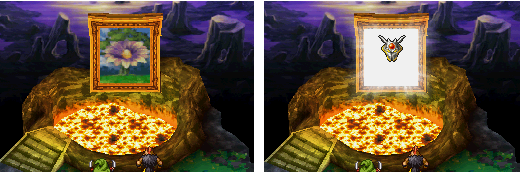

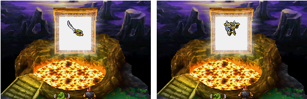

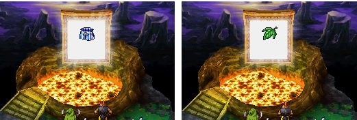

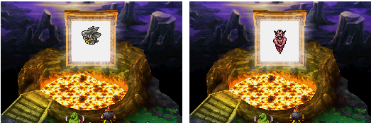

## Solution
To start the quest, you need a good team (see boss section for level). After finishing chapter 5, teleport to the town of Azimut. Once inside, save the game and head north-east into the town. You'll then see a hole, so jump in. Cross the cave by opening the chests until you reach a small house with a red roof. Go inside and then down the stairs at the top right of the room. You'll be back in front of the house, but there's an exit at the back. Once you've reached the Knife Chapel after a long crossing, save the game and this will be the last teleportation point in the game. Continue north and you'll eventually come to a teleporter that takes you past the famous Bosses. Face them and they'll give you the gifts mentioned above.

## BOSSES
### Eggguy

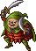

| No. | HP | MP | Attack | Defense | Agility | XP | Gold | Object |
|-----|----|----|--------|---------|---------|----|------|--------|
| 209 | - |  -  |  -  |  - |    -    | - |  -  | MP seed |

### Chickenguy

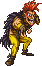

| No. | HP | MP | Attack | Defense | Agility | XP | Gold | Object |
|-----|----|----|--------|---------|---------|----|------|--------|
| 210 | - |  -  |  -  |  -  |    -    | - |  -  | Life seed |

**Recommended Level and Team**: All team (Level 40)

**Tips to Defeat the Boss**: The path to the two chickens is quite long the first time, but once you reach the chapel you gain a save point and a place where you can teleport to get back there more quickly. If you still find the path too difficult, practise because the bosses are even more powerful and you need to spend as few MP as possible along the way (unless you have lots of items to restore MP).

These two bosses have a lot of health points, so don't think you can defeat them by relying on a critical attack. Look after yourself regularly.

There are two bosses against you: The one on the left, Cent-âge, has healing and protection abilities, as well as fire and ice attacks that can hit all your characters at once. He can also remove boosts from your team. The one on the right attacks twice a turn, can concentrate and inflict heavy physical damage on all your characters. From time to time, it can launch a curtain of feathers that absorb all combat (allies and enemies) for one turn. The strategy I'm proposing uses up a lot of MP, but allows you to finish this boss without levelling up too much. Kiryl casts Megaprotection twice and attacks or heals, Borya casts Alteration on the targeted enemy (or MegaAlteration), Decuplo on the two allies and offensive spells if he can. The hero casts omnisoin, attacks or uses the Zenithian sword as an item to remove the boosts from the opposing team. We advise you to start with cent-age.

Note: having a conjuration ring or the appropriate ability is very handy (use a character other than the one in your main team to do this, don't waste time resurrecting them as they will have no MP left if you've used the spell and the ring will have been destroyed if you haven't).

Once Psaro is in your team, you can fight them several times to obtain the ultimate equipment for Psaro.

Note that to fight them again after beating them, you have to return to the teleportation portal and cross it again in both directions.

## After BOSSES:
If you're still having trouble finding these two enemies, see the solution in the EX chapter.

## Hoffman Junior's migrant city
### Presentation
This quest will allow you to help Hank Hoffman Junior realise his dream of creating a new town. As you help him build the town, you'll be able to find a number of rare items, such as mini-medals, and gain access to a new casino.

### Conditions
You can start this quest during Chapter 5 without any special conditions. However, some of the characters in the town can only be found as you progress through the main quest. For example, you'll need to complete the game once to unlock the EX chapter, where you can invite one of the last inhabitants.

### Rewards
You'll be able to find a whole host of items as you wander through the town's alleyways. Be careful, though, as the items in the city of migrants must be collected during each stage. Otherwise, they will be lost forever! Don't forget to collect the mini-medals at each stage of the town's development! It's also worth noting that, thanks to you, some shops will be able to open, as well as a casino offering items that can't always be found elsewhere. Finally, the best reward of all will be having helped Hoffman make his dream come true, so you can feel proud of having played a part in creating this whole community!

### Prologue
In Chapter 2, you passed through a town called 'The Bazaar' to the south-west of Taborov. It was an oasis in the middle of the desert where various merchants and travellers gathered. This is where your town will be built from Chapter 5 onwards.

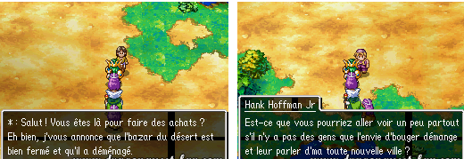

In the course of the adventure, you meet Hank Hoffman Jr, whom you must accompany to Ringys, after which he decides to found his own village on the site of the old Bazaar, following the advice of the old man Iton. To continue this quest, however, you must obtain the Magic Key when Alina and Kirly are in your team. Return to the Bazaar to join Hoffman, who will ask for your help in gathering the inhabitants.

We strongly advise you to complete this quest, as it offers a host of sometimes very interesting benefits (mini-medals, new items, a new casino and even new Wi-Fi character creation options). On the other hand, you'll need to be careful to make the most of each phase of the village's construction, as some things (like the mini-medals) will disappear as you move from one phase to the next.

### Phase 1
Once you have fulfilled the conditions explained above to begin this quest, go and see Hank Hoffman Jr at the Desert Bazaar. He'll ask for your help in finding a nun living in Teafortwo. Teleport to the town and enter the church immediately on your left (3).

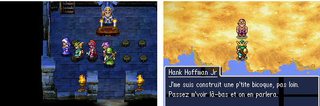

After a brief chat, she decides to join Hoffman. Hoffman explains that he has chosen to live in a small house right next to the future village. Take the time to visit the village and talk to the nun so that she can join Hank in his house.

Leave the village and enter the bicote just outside the village. You can talk to the nun if you want to save your game. Inside, talk to Hoffman, who will suggest that you give the town a name. The choice is yours. Then you can create a character that you can exchange via Wi-Fi.

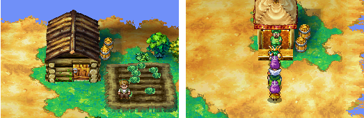

|Character           |Gender  |Age |Occupation       |City          |
|--------------------|--------|----|-----------------|--------------|
|Merchant Bill       |Male    |50  |Flattery         |Ringys        |
|Farmer Rocky        |Male    |20  |Handyman         |Port-Carène   |
|His wife Adrienne   |Female  |20  |Puff-puff Enthusiast|Port-Carène |
|The frog Crapaud    |Unknown |30  |Cruises          |Your City     |

|Item               |Price (gp)|
|-------------------|----------|
|Chimera Wing       |25        |
|Medicinal Herb     |8         |
|Healing Herb       |10        |

|Item               |Location|
|-------------------|--------|
|Rabbit Tail        |Barrel  |
|Medallions         |Barrel  |

### Phase 2
To continue building the town, you normally need to have defeated Boss Estark at the Alpion mines (towards the end of the chapter after the stone colossus). You need to speak to Farmer Rocky, who will tell you that the next character to be found is in Bastione.

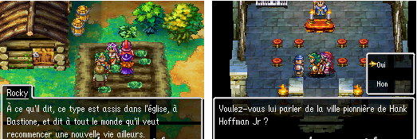

Once inside, enter the church and speak to the seated pirate called Tibias. Tell him about your village so that he'll go there, then go and find his companion Gino Allaydi who's at the inn in the same town. The village is now level 2, so you can see the many changes detailed below.

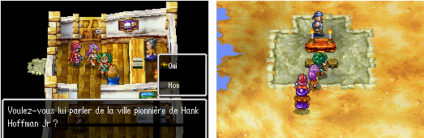

|Service                      |Price (gp)|
|-----------------------------|----------|
|Inn                          |36        |

|Character                    |Gender  |Age |Occupation           |City           |
|-----------------------------|--------|----|---------------------|---------------|
|Innkeeper Maddie            |Female  |50  |Frugality            |Port Lionel    |
|Pirate Tibias               |Male    |40  |Talking in Sleep     |Bastione       |
|Bard Gino Allaydi           |Male    |30  |Playing Music        |Bastione       |
|Dog Medor                    |Unknown |Ado.|Going to Restaurants|Your City       |

|Item                        |Price (gp)|
|-----------------------------|----------|
|Chimera Wing                |25        |
|Medicinal Herb              |8         |
|Healing Herb                |10        |
|Musk Sack                   |150       |

|Item                        |Location|
|-----------------------------|--------|
|Healing Herb                |Jar     |
|Vitality Seed               |Jar     |
|Diadem                      |Chest   |
|Mini Medal                  |Wardrobe|
|Mini Medal                  |Floor   |

|Infrastructure                   |Location                   |
|----------------------------------|---------------------------|
|Inn with 2 rooms                 |Port Lionel                |
|Small house in the Northeast     |Your City (North-East)     |
|Altar in the Southwest, led by Tibias|Your City (South-West)   |

### Phase 3
Once you've collected the items from level two, which will disappear later, you need to speak to Gino the Bard, who will tell you that a couple were looking for pirate treasure in a nearby cave. First of all, you need the Ultimate Key to continue. It's actually to the north-east of RoseColline, behind the mountains, and you can get there by boat or balloon.

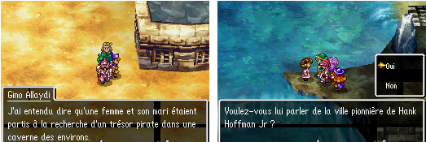

The cave is surrounded by water. At the entrance, you'll find Carla waiting for her husband, who is lost in the cave. Go inside and you'll soon spot him. Tell him about the village so that he'll want to go there with his wife. Once you arrive in the town, you can chat with Gino Allaydi, as well as reading books to learn a little more about the history of the town, which used to be called Pioniria. The village is on level 3.

|Service                      |Price (gp)|
|-----------------------------|----------|
|Inn                          |45        |

|Character                    |Gender  |Age |Occupation        |City         |
|-----------------------------|--------|----|------------------|-------------|
|Elf in the Church Willis     |Male    |80  |Pet Grooming      |Rosecolline  |
|Armorer Isaac                |Male    |80  |Hot Springs Cure  |Bourg-les-bains|
|Treasure Hunter Amédée Carte |Male    |30  |Reading           |Chandor      |
|His wife Carla               |Female  |20  |Aromatherapy      |Chandor      |

|Item                        |Price (gp)|
|-----------------------------|----------|
|Chimera Wing                |25        |
|Medicinal Herb              |8         |
|Healing Herb                |10        |
|Musk Sack                   |150       |
|Sacred Water Flask          |20        |
|Moonwort Bulb               |30        |

|Item                        |Price (gp)|
|-----------------------------|----------|
|Rabbit Tail                 |230       |
|Gold Bracelet               |350       |
|Star Shard                  |500       |

|Infrastructure                   |Location                   |
|----------------------------------|---------------------------|
|Clara's Shop                     |City                       |
|Roads                             |City                       |
|Pioneeratorium                    |City                       |
|Church led by Willis              |Rosecolline                 |
|Temporary Lodging for Isaac       |City                       |

|Item                        |Location   |
|-----------------------------|-----------|
|Gold Coins                  |Barrel     |
|Chimera Wing                |Wardrobe   |
|Magic Water Flask           |Barrel     |
|Seed of Strength            |Barrel     |
|Seed of Life                |Barrel     |
|Seed of Magic               |Jar        |
|Medallion                   |Barrel     |
|Medallion                   |Pot        |
|Medallion                   |Floor      |

### Phase 4
To continue, talk to Isaac for more information. He'll tell you about a rumour that there's a creature with lots of legs in Strattbourg prison.

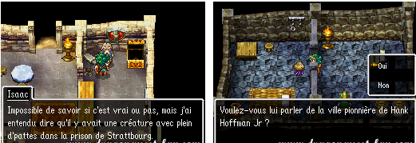

Once in the city, sneak into the underground gaols to discover a poor, slimy midget locked up. He's looking for a second chance at a better life than his current one, and you're going to offer him that chance by opening the gate and telling him about the village so that he goes there. Back in the town, you can find out more about its past by talking to the various inhabitants. The village is on level 4.

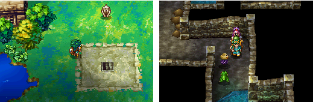

|Service                      |Price (gp)|
|-----------------------------|----------|
|Inn                          |90        |

|Character                     |Gender  |Age |Occupation              |City         |
|------------------------------|--------|----|------------------------|-------------|
|Slime Medea Medoc             |Unknown |30  |Cheesy Jokes            |Bastione     |
|Armory Seller Johnson         |Male    |40  |Volunteerism            |Vrenor       |
|Princess Pam                  |Female  |Ado.|Corner Decorations      |Fémiscrya    |
|Advisor Hervé Stige           |Male    |50  |Astrology               |Canalot      |
|Talking Horse Mr. Ned          |Unknown |20  |Decalcomania            |Your City    |

|Item                        |Location   |
|-----------------------------|-----------|
|370G                         |Barrel     |
|Bento Lunch                  |Pot        |
|Seed of Wisdom               |Pot        |
|Seed of Magic                |Pot        |
|Horse Dropping               |Barrel     |
|Fire Claw                    |Floor      |
|Fur Cloak                    |Barrel     |
|3 Medallions                 |Floor      |

|Item                        |Price (gp)|
|-----------------------------|----------|
|Hermes Scarf                 |650       |
|Charm Ring                   |880       |
|Conjuring Bracelet            |10000    |
|Star Shard Removal            |          |

|Item                        |Price (gp)|
|-----------------------------|----------|
|Iron Armor                   |1200      |
|Glittering Robe              |2000      |
|Floating Robe                |15000     |
|Power Shield                 |13000     |
|Iron Mask                    |3500      |

|Item                        |Price (gp)|
|-----------------------------|----------|
|Iron Armor                   |1200      |
|Glittering Robe              |2000      |
|Floating Robe                |15000     |
|Power Shield                 |13000     |
|Iron Mask                    |3500      |

|Infrastructure                |Location             |
|-------------------------------|----------------------|
|Church Development             |City                  |
|Stable for Mr. Ned             |City                  |
|Pioneeratorium                 |City                  |
|Long Underground Passages (unfinished)|City          |

### Phase 5
To reach the final phase of this town, you'll need to speak to Princess Pam at the inn, who feels she needs a guard to stay here. She then claims to have seen a future soldier in the town of Teafortwo.

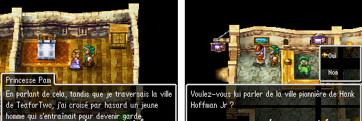

Teleport there and enter the inn to convince the Payer guard in front of the innkeeper to become a citizen of your town. Then talk to farmer Rocky in your village, who advises you to meet a king in Port Lionel. Rex is in front of the first table in the Port tavern.

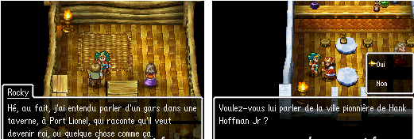

Your town has now reached castle status. It extends over several floors, has a courtyard full of flowers and even a moat full of water surrounding it. The special feature of this phase is that all the infrastructure has been brought together within the castle. It's up to you to search it from top to bottom, talking to as many citizens as possible. However, your mission is still to free the sultan.

To do this, start by freeing his body from a jar in the room above the Rocky-Adrienne couple. Then, in the vault room in the basement of the castle, you will find his body in a chest. Once this is done, he will appear on his throne at the top of the castle.

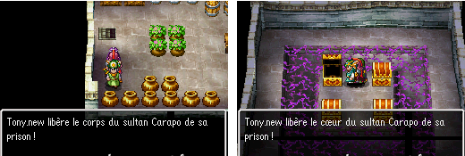

|Service                      |Price (gp)|
|-----------------------------|----------|
|Inn                          |135       |

|Character                     |Gender  |Age |Occupation        |City            |
|------------------------------|--------|----|------------------|----------------|
|King Rex                      |Male    |60  |Swimwear Enthusiast|Port Lionel     |
|Commando Hannibal             |Male    |30  |Juggling          |Your City       |
|Bookmaker Flocon              |Male    |50  |Meteorology       |Alpion          |
|Guard Payer                   |Male    |20  |Barrel Breaking    |Teafortwo       |
|Sultan Carapo                 |Male    |30  |Cruises           |Your City       |
|Queen Psaro (EX Chapter)      |Female  |    |                  |                |

|Character                     |Gender  |Age |Occupation        |City            |
|------------------------------|--------|----|------------------|----------------|
|King Rex                      |Male    |60  |Swimwear Enthusiast|Port Lionel     |
|Commando Hannibal             |Male    |30  |Juggling          |Your City       |
|Bookmaker Flocon              |Male    |50  |Meteorology       |Alpion          |
|Guard Payer                   |Male    |20  |Barrel Breaking    |Teafortwo       |
|Sultan Carapo                 |Male    |30  |Cruises           |Your City       |
|Queen Psaro (EX Chapter)      |Female  |    |                  |                |

|Item                        |Price (gp)|
|-----------------------------|----------|
|Dream Sword                 |8000      |
|Dragonbane                  |15000     |
|Miracle Sword               |31000     |
|Carnage Whip                |65000     |
|Angel's Body                |13000     |
|Shock Bracelet              |37000     |

|Item                        |Price (gp)|
|-----------------------------|----------|
|Plate Armor                 |2300      |
|Dragon Mail                 |5200      |
|Floating Robe               |15000     |
|Wind Shield                 |20000     |
|Iron Mask                   |3500      |

|Item                        |Location                                        |
|-----------------------------|-------------------------------------------------|
|Agility Seed                |Barrel in Adrienne and Rocky's room             |
|Carapo's Body               |Jar in Adrienne and Rocky's room                 |
|Mini Medal                  |Jar in Adrienne and Rocky's room                 |
|Falcon Knife                |On the ground, behind the tree left of the castle|
|Mini Medal                  |Barrel in Flocon's room                         |
|Mini Medal                  |Wardrobe in Flocon's room                       |
|Mini Medal                  |On the ground near the dog in the courtyard     |
|Carapo's Heart              |Chest in the treasure room                      |
|Ruby of Protection          |Chest in the treasure room                      |
|Miracle Sword               |Chest in the treasure room                      |
|Mirror Shield               |Chest in the treasure room                      |
|Mini Medal                  |Barrel in Isaac's room in the basement          |
|Meteor Bracelet             |Chest in the basement                           |
|Mini Medal                  |Gift from Sultan Carapo                         |

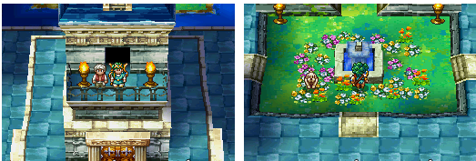

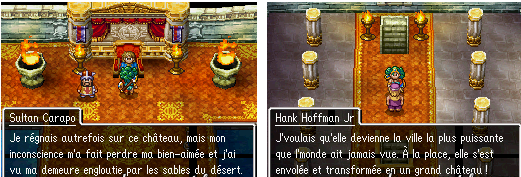

## Casino
### Presentation
This quest will allow you to pick up some very rare items, such as the Evangelical Ring, which is a very useful accessory, or some very powerful protection, such as the Helmet of Mercury, by playing in casinos.

### Conditions
You'll be able to enter Chandor's casino as soon as you arrive in the town in chapter 2. However, it will no longer be available during chapter 3 until you start building Chandor's tunnel, when one of the employees working there will inform you that the casino has reopened. From chapter 4 onwards, this gaming hall will be open for good. The casino is located in the basement of the inn to the west of the town.

As for the second casino, which is the most interesting, it will only be available if you complete the travelling city side quest (see quest section) until your city becomes a castle. Like Chandor's, it too is located in the 1st basement of your castle.

### Rewards
You can win lots of items by playing in the casinos. When you arrive, you'll have to turn a real sum of money into chips. The market rate is 1 token for every 20 gold coins given. You can then use these tokens to place bets and buy items in the casino shops.

**Chandor Casino:**
|Chips |Desired Item          |
|------|----------------------|
|30    |Magic Water Flask     |
|500   |Prayer Ring           |
|1000  |Gold Bracelet         |
|2500  |Glittering Robe       |
|10000 |Meteor Bracelet        |
|65000 |Falcon Knife          |

**Your City Casino:**
|Chips   |Desired Item              |
|--------|--------------------------|
|500     |Kamikaze Bracelet         |
|1000    |Magic Skirt               |
|3000    |Staff of Thalia           |
|10000   |Mirror of Ra              |
|100000  |Mercury's Helm            |
|250000  |Evangelical Ring          |

## Solution
### Slot machines
Both casinos have slot machines. To play them, all you have to do is insert one or more chips inside, and line up three identical symbols. You can bet up to five times per game: the more chips you insert, the more lines (horizontal, vertical, diagonal) are taken into account.

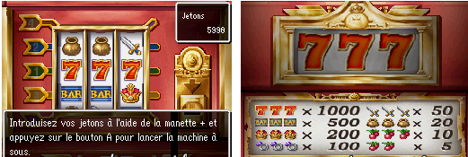

In both casinos there are only machines that allow bets of 1 chip - a jackpot of 1,000 chips. Be careful, the chances of winning are slim.

### Poker
You can also play poker in both casinos. This is a card game where you simply have to make the best possible card combination. You start by betting between 1 and 10 chips, and the dealer will then offer you a deck of 5 cards. You can choose to keep them or discard the ones you don't need to get new cards to make the most profitable combination.

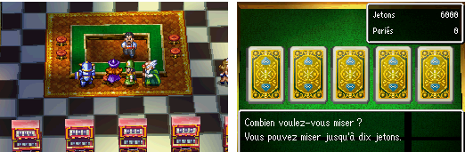

The order of the ascending cards is: 2-3-4-5-6-7-8-9-10-J-Q-K-A, Joker. The 4 signs are : Sword, Crown, Goo, Shield, Joker. There is a "Joker" in this game, which can play the role of any card to make a combination.

You can see the order of the combinations in the image below:

|Combination           |Description                                                                                                      |
|----------------------|------------------------------------------------------------------------------------------------------------------|
|1. Royal Slime Flush  |The jackpot, having a sequence up to Ace with the slime symbol on each card. (e.g., 10-J-Q-K-A)                  |
|2. Royal Flush         |Having a sequence up to Ace with the same suit on each card but not a slime. (e.g., 10-J-Q-K-A)                   |
|3. Poker               |We have no information on this combination as the writer failed to achieve it, and it does not exist in official poker rules.|
|4. Straight Flush      |Making a sequence with 5 cards of the same suit (e.g., 2-3-4-5-6 with the crown suit)                             |
|5. Four of a Kind      |Having 4 cards with the same number (e.g., 7-7-7-7)                                                               |
|6. Full House          |All cards must be useful (e.g., having a Three of a Kind with a Pair: 3-3-3-2-2)                                   |
|7. Flush               |5 cards having the same suit (e.g., 5 cards with the sword symbol)                                               |
|8. Straight            |Making a sequence with 5 cards regardless of the suit (e.g., 3-4-5-6-7)                                          |
|9. Three of a Kind     |Three cards with the same number (e.g., 8-8-8)                                                                   |
|10. Two Pairs          |Four cards with two pairs being identical (e.g., 6-6 and 8-8)                                                    |

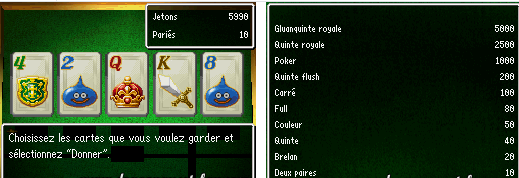

When you win tokens, you are then offered the "Double or Quits" option, which allows you to play again to win double the tokens you previously won (e.g. if you win 80 tokens, you can win 160 in the next round). In the next round, you must draw a card at random that is stronger than the one the brewer turned over first.

If you lose this round, you won't get any tokens but you will lose your initial stake - that's the risk.
-If you win this game of chance, the stake will double again, and this can go on until you win 10,000 chips.

### The arena
Finally, in Chandor's casino there is an arena where you can bet on one of the monsters on offer in the hope that it will win the fight that will take place in the arena. You can normally bet between 1 and 50 tickets (1 ticket = 1 token). Bet on the fighter of your choice. The 'x5.0' in front of a monster's name represents the rate at which your chips will be multiplied if you win (e.g. if you bet 5 chips on a monster with a rate of 6.2, you will win 31 chips), so the higher the rate, the lower the chances of that monster winning. On the other hand, a monster with a low rate is likely to emerge triumphant.

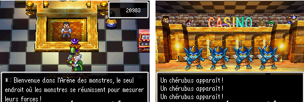

-If your monster emerges victorious from the battle, the chips won can be bet on immediately afterwards, so you have to take the risk to reach the big sums.
-If you lose, the number of tickets you paid for will be lost.

-If the fight drags on without a winner, it's called a draw: you get your last bet back to bet on a new fight.
Some fights will end up being repeated with the same monsters, so it's important to spot the ones that win most often to increase your chances of success. You could, for example, bet a single token at the start to get used to the arena, then later bet 50 tickets at once, which will be multiplied as you win more and more! However, I've done quite a few tests and chance also plays a big part, except for certain battles where the difference is obvious: Belzébic versus Roi guérigluant where the first wins, Elépieuvre versus Ornitro and Scaromiaque where the first wins, Armure fatale versus Tizon and Tigrrr where the last wins... etc.

In short, this is the arena where you can win the most chips in this casino, even though it's difficult because the stakes aren't very high. In order to stack the odds in your favour, you'll need to spend a lot of time in the arena to get to know the best monsters. One of our members won 35,000 chips.

### Tips
There are two ways to earn extra casino chips.

Firstly, in chapter 5, you have to cross the newly-built tunnel leading to Chandor several times to receive confetti on the head from a guard, who tells you that you are the thousandth person to have crossed this tunnel! As a reward, he offers you 100 tokens to play with at the Chandor casino!

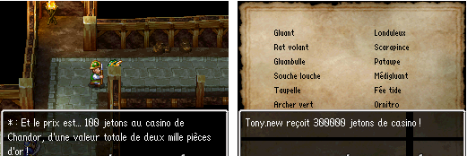

-The second way of earning tokens is much more difficult, as you'll need to have completed your Bestiary (Book of Creatures) in full, and thus earn no less than 300,000 tokens! Enough to buy yourself an Evangelical Ring with a Helmet of Mercury, for example.

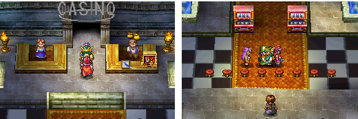

Apart from that, your town's casino has the Rainbow Treasure Bank, so you don't have to hesitate to go and get some money to ruin yourself (or not). It's a good idea, but it's a shame you won't be getting any of the casino's profits... You can also talk to the barman who will give you some advice on the slot machines while a singer performs on stage in front of a non-existent audience...
