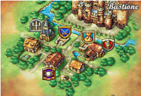
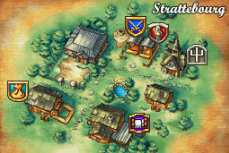
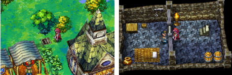
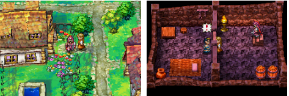
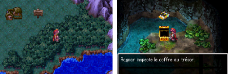
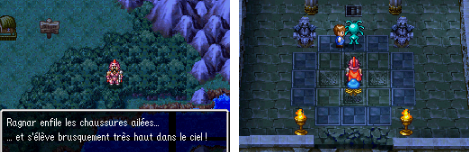
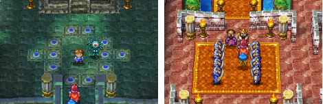
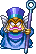

# Dragon Quest IV: Chapters of the Chosen

  

## 📖 Table of contents

1. [Main Story](#-main-story)
    - [Chapter 1: The Epic of Ragnar McRyan](#-chapter-:-1-The-Epic-of-Ragnar-McRyan)
    - [Chapter 1]
    - [Chapter 1]
    - [Chapter 1]
    - [Chapter 1]
    - [Chapter 1]
2. [Sides Quest]()
3. [Bestiary]()
4. [Map](#map)

# Main Story
## Chapter 0: 
## Chapter 1: The Epic of Ragnar McRyan
In this first chapter, players are introduced to Ragnar McRyan, a knight of Burland. The King entrusts Ragnar with the mission of tracking down Psaro the Butcher, the thief of the Zenithian Sword. Ragnar, accompanied by his friend Cristo, sets off in search of justice. On their journey, they meet the vivacious Alena, a warrior princess who seeks to defy royal convention. The team gradually comes together and discovers that Psaro's motives run deeper than mere theft. They uncover royal plots and buried secrets, and prepare for the challenges ahead.

### Bastione Castle
You are now in command of a soldier of King Bastien: Ragnar McRyan, from the kingdom of Bastione. During a dialogue with the King, you learn that mothers have come to protest the disappearance of their children. After the dialogue with the King, one mother even comes to beg you to bring her son back. After that, head south out of the castle.

Continue southwards and you'll come across a market town. Talk to as many people as you can and get to know them. Once you've done that, head out of the town and you're back on the world map!

### Strattebourg Village
Head north-west and you will come to a cave. The monsters are more numerous, so don't be easily fooled by a shortage of life.
Cross the cave and find the exit to the north of it. This exit leads to the other side of the river, on the world map. Head west. You will discover a town: Strattebourg.

Inside, talk to as many people as you can. Then head north of the town to a secluded area, where you'll find a staircase in the ground.

Inside, you discover a cell inhabited by its prisoner. He tells you he is innocent and wants to get out. There's nothing you can do for him at the moment. However, get into the habit of breaking jars to find medicinal herbs. Leave the prison and go to the church to save yourself if you wish. Now you need to return to the original castle to announce your discoveries. Go back through the cave, killing a few monsters along the way to enhance your experience. Back in the castle town, go into a house to the west, go upstairs and find a man and a woman. The woman tells you that she knows the man in the cell! She asks you to take her to see him. So you have to go through the cave again... Return to Strattebourg by the route you should now know with your eyes closed.

Go straight to the prison. You're presented with a mini-scene in which the wife uses the puff-puff technique to knock some sense into her lucky husband. He tells you that there is a garden in the forest where strange things happen. So get out of Strattebourg and into the forest.

### Find the childrens
You eventually find the park. A path indicates the entrance to a well. Enter it. Inside, the path guides you to the right path, pointing you in the right direction.

Finally, you come across a chest containing the winged shoes. Explore the cave, taking care to avoid the many monsters. Stairs to the south-east lead you to a Healslime who can accompany you to heal you in battle if your health points are running low. Then exit the cave and use the winged shoes.

Here you are at the top of a tower, just west of the town of Strattebourg. You're witnessing a mini-scene between a child and an eye on legs. The dungeon isn't very big, so it's easy to make your way through the maze using the swivel view controls, which are very useful here.

Watch out for the much stronger monsters, though. Nevertheless, the presence of the medigluant should make your task much easier. On your way you come across two soldiers from the Empire. The second is in a bad way, and before the fatal moment, he tells you about a terrible enemy that can only be defeated by a chosen child. Continue on your way. You will come to a large room where you will find the eye on legs at the top of the tower. Talk to him and then to the child. You'll notice a figure to the north of the room, your first boss, so arm yourself heavily and set off with your life points at maximum. Talk to him to start the fight.

It's not a rocket scientist, but it's dangerous. Eliminate the eye first, leaving only the other. Use a combination of strikes and healing if necessary, and you'll get the better of it in no time.

## Boss 
### Pisaro's Hands

| No. | HP | MP | Attack | Defense | Agility | XP | Gold | Object |
|-----|----|----|--------|---------|---------|----|------|--------|
| 195 | 250| 0  |   52   |   36    |   16    | 73 | 60   | None   |

**Recommended Level and Team**: Ragnar, Doc (Level 9)

**Tips to Defeat the Boss**: 
Have the best possible equipment: the burning sword you find in the tower, iron armor, wooden helmet, iron shield (important, allows to reduce spell damage). Don’t forget to restore your HP/MP at the goddess statue before the boss, and put two or three herbs on Ragnar as a precaution.

Start by destroying the critter that accompanies him and focus on him. He can cast flame (quite high damage on one character), blow fire (rather weak damage on all) or physically attack (quite strong). Don’t trust your companion too much in case of a hard hit, it happens that he attacks or defends instead of healing… so if his hp or yours are low, don’t hesitate to use a herb. The boss should not resist too long anyway.

## Chapter 2: The intrepid merchant, Torneko Taloon
The focus shifts to Torneko Taloon, an ordinary merchant with extraordinary aspirations. Torneko quits his job to pursue his dream of owning his own shop. Players follow his adventures through dangerous dungeons as he collects treasure and learns the tricks of the trade. Torneko becomes an endearing character, and his story shows that even heroes can have ordinary professions.

## Chapter 3: The mystical world of Meena and Maya
Twin sisters Meena and Maya seek revenge against Balzack, their father's murderer. Their quest takes them through mystical lands, populated by monsters and magical mysteries. Meena, a magician with psychic powers, and Maya, an agile dancer, form a formidable team. Together, they discover hidden truths about magic and the origins of their world.

## Chapter 4: The Chosen Hero
The previous chapters converge on the Chosen Hero, a silent character that players can customise. The Hero brings together the characters from the previous chapters, forming a motley crew. They learn that Psaro the Butcher is not the true antagonist, but rather a person in search of redemption after the loss of his beloved. The team embarks on a journey to save the world, discovering key elements of the story and facing increasingly powerful adversaries.

## Chapter 5: The World of Darkness
Les héros découvrent l'existence d'un monde souterrain dirigé par Estark, une force maléfique. Ils doivent collecter des artefacts sacrés pour renforcer leur pouvoir et obtenir l'alliance des monstres opprimés par Estark. Ce chapitre met en avant des batailles épiques, des moments de sacrifice et des révélations sur l'histoire ancienne de leur monde. Les enjeux atteignent un sommet alors que l'équipe se prépare à affronter Estark.

## Chapter 6: The Epic Conclusion
The final chapter sees the group take on Estark in an epic battle to save the world. Psaro the Butcher realises the true meaning of love and sacrifice, bringing an emotional dimension to the story. After intense battles, moments of reflection and difficult choices, peace is finally restored to the world. The heroes return to their daily lives, forever scarred by the trials they have overcome.

## Map

  

